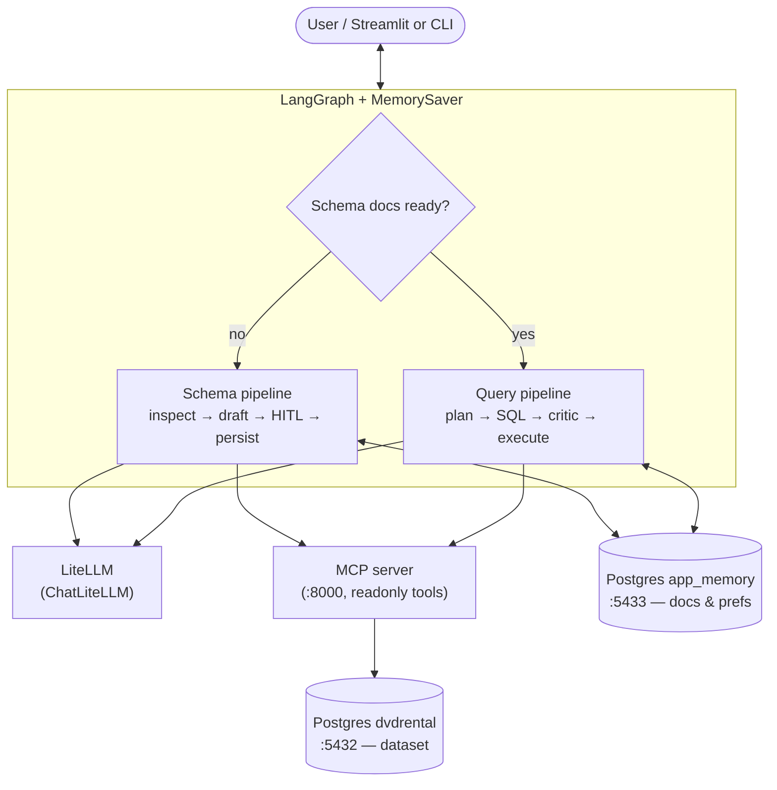

# db-multiagent-system

A **natural-language query system** over PostgreSQL built with **LangGraph**, two agents (Schema + Query), an MCP tool server, and persistent memory — evaluated on the **DVD Rental** dataset.

| Doc | Role |
| --- | --- |
| [TASK.md](TASK.md) | Full assignment: agents, memory, MCP, deliverables, rubric |
| [AGENTS.md](AGENTS.md) | Repo workflow: `uv`, safety rules, Git conventions, verification |

---

## Architecture

Runtime view: the same compiled **LangGraph** workflow runs from **Streamlit** ([`src/ui/app.py`](src/ui/app.py)) or the **CLI** ([`main.py`](main.py)) — with **`MemorySaver`** for HITL/thread state, **LiteLLM** via **`ChatLiteLLM`**, and the **DVD Rental** database reached through an **MCP** server (HTTP) using **`MultiServerMCPClient`** from **`langchain-mcp-adapters`**. Persisted app state (schema docs + user preferences) lives in a **separate Postgres** instance from the dataset the MCP tools query.



**Compose topology** (three services): `postgres` (dvdrental), `mcp-server` (tools against dvdrental), `postgres-app-memory` (app_memory). The graph nodes call **`LLM_SERVICE_URL`** and **`MCP_SERVER_URL`** from the host.

---

## Prerequisites

- **Python** `>=3.12` (see `.python-version` / `pyproject.toml`)
- **[uv](https://github.com/astral-sh/uv)** for environments and dependencies
- **Docker** for PostgreSQL (**dvdrental** + **app_memory**) and the **MCP** server container

---

## Quick start

### 1. Install dependencies

```bash
uv sync
```

### 2. Start Docker services

`docker compose up -d` brings up **three** services: `postgres` (DVD Rental on **5432**), `postgres-app-memory` (app state on **5433**), and `mcp-server` (MCP tools on **8000**).

```bash
docker compose up -d
```

Wait until the Postgres containers report healthy:

```bash
docker ps --filter name=multiagent
```

### 3. Configure environment

```bash
cp -n .env.example .env
# Edit .env if your host/port/credentials differ from the Compose defaults
```

### 4. Run

```bash
# Interactive REPL
uv run python main.py

# One-shot question, then drop into REPL
uv run python main.py -q "Show me the top 5 most rented films"

# Single non-interactive question via stdin
echo "How many customers are there?" | uv run python main.py

# Skip the Postgres connectivity check
uv run python main.py --no-bootstrap
```

On first run (no schema docs persisted yet) the system automatically goes through the **Schema Pipeline**: it inspects the database, drafts descriptions with the LLM, then pauses for your approval before writing anything. After you approve, subsequent runs go straight to the **Query Pipeline**.

### 5. Streamlit UI

The web UI uses the **same** compiled graph, checkpointing, and `graph_run_config` as the CLI, with **`run_kind="streamlit"`** so LangSmith traces can be filtered separately from CLI runs. Schema HITL is handled in the browser (approve or edit JSON) instead of the terminal.

```bash
uv run streamlit run src/ui/app.py
```

Use the same `.env` / Docker setup as above. Optional: set **`DEFAULT_THREAD_ID`** to pin the LangGraph thread for the session; otherwise the UI generates a stable id per browser session. **New chat** in the sidebar starts a fresh thread id and clears the transcript.

---

## Environment variables

| Variable | Purpose |
| --- | --- |
| `POSTGRES_HOST` | DVD Rental DB host (e.g. `localhost`) |
| `POSTGRES_PORT` | DVD Rental DB port (`5432` in Compose) |
| `POSTGRES_USER` | DB user (`postgres` in Compose) |
| `POSTGRES_PASSWORD` | DB password |
| `POSTGRES_DB` | Must be **`dvdrental`** |
| `APP_MEMORY_HOST` | App memory DB host (e.g. `localhost`) |
| `APP_MEMORY_PORT` | App memory DB port (`5433` in Compose) |
| `APP_MEMORY_USER` / `APP_MEMORY_PASSWORD` / `APP_MEMORY_DB` | Credentials and database name **`app_memory`** |
| `MCP_HOST` | MCP server bind host (client-side; container uses `0.0.0.0`) |
| `MCP_PORT` | MCP server port (default `8000`) |
| `MCP_SERVER_URL` | Full MCP client URL (e.g. `http://127.0.0.1:8000/mcp`) |
| `LLM_SERVICE_URL` | LiteLLM proxy root URL |
| `LLM_API_KEY` | API key for the LiteLLM proxy |
| `LLM_MODEL` | Model id as routed by LiteLLM |
| `QUERY_MAX_REFINEMENTS` | Max critic → SQL retries (default `3`) |
| `DEFAULT_USER_ID` / `DEFAULT_THREAD_ID` | Memory + LangGraph thread defaults |
| `LANGSMITH_*` | Optional tracing to LangSmith ([Observability](#observability-langsmith) below) |

See [`.env.example`](.env.example) for all defaults.

---

## Observability (LangSmith)

Set tracing env vars (see [.env.example](.env.example)), then run a CLI question so LangGraph emits a trace:

```bash
export LANGSMITH_TRACING=true
export LANGSMITH_API_KEY=your_key_here
export LANGSMITH_PROJECT=dvdrental-local
uv run python main.py -q "How many actors are there?"
```

Open your [LangSmith](https://smith.langchain.com/) project (same name as `LANGSMITH_PROJECT`, default `dvdrental-local` in `.env.example`) and inspect the run tree: graph nodes, LLM calls, and MCP tools such as `execute_readonly_sql` nested under the same invocation. Use `LANGSMITH_ENDPOINT` only for EU or self-hosted deployments.

Filter UI vs CLI using trace metadata **`run_kind`** (`streamlit` from Streamlit, `cli` from `main.py`).

The CLI still emits **errors and warnings** to stderr; LangSmith remains the primary place for full run trees and spans.

---

## Project layout

```text
.
├── main.py                      # CLI: Postgres bootstrap + LangGraph REPL / HITL resume (dev/testing)
├── pyproject.toml               # uv / hatch packages under src/*, Ruff, pytest markers
├── uv.lock
├── docker-compose.yml           # postgres (dvdrental), postgres-app-memory, mcp-server
├── Dockerfile                   # Image for mcp-server
├── TASK.md / AGENTS.md          # Assignment + repo agent rules
├── data/
│   └── schema_catalog.json      # Optional exported schema catalog (artifact)
├── db/
│   ├── dvdrental.tar            # DVD Rental dataset archive
│   └── restore-dvdrental.sh     # Init script mounted into the dvdrental container
├── specs/                       # Incremental design notes (spec-driven)
├── src/
│   ├── agents/
│   │   ├── query_agent.py       # Structured LLM: plan + SQL (QueryPlanOutput, SqlGenerationOutput)
│   │   ├── schema_agent.py      # Structured LLM: SchemaDraftOutput
│   │   ├── prompts/             # Prompt strings (query, schema)
│   │   └── schemas/             # Pydantic output models
│   ├── config/                  # pydantic-settings: postgres, app memory, MCP, LLM
│   ├── graph/
│   │   ├── graph.py             # StateGraph wiring, MemorySaver, graph_run_config()
│   │   ├── invoke_v2.py         # unwrap_graph_v2 (CLI + Streamlit, version="v2")
│   │   ├── state.py             # GraphState
│   │   ├── presence.py          # DbSchemaPresence — gate on schema_docs
│   │   ├── schema_pipeline.py   # schema_inspect … schema_persist
│   │   ├── query_pipeline.py    # query_load_context … query_refine_cap
│   │   ├── memory_nodes.py      # memory_load_user, memory_update_session
│   │   └── mcp_helpers.py       # MultiServerMCPClient + tool result helpers
│   ├── llm/
│   │   └── factory.py           # create_chat_llm() → ChatLiteLLM (LiteLLM-compatible API)
│   ├── memory/
│   │   ├── db.py                # Connect to app_memory database
│   │   ├── schema_docs.py       # Persisted approved schema descriptions
│   │   ├── preferences.py       # User preferences store
│   │   └── session.py           # Session snapshot helpers
│   ├── mcp_server/
│   │   ├── main.py              # FastMCP Streamable HTTP entry
│   │   ├── tools.py             # inspect_schema, execute_readonly_sql
│   │   ├── readonly_sql.py      # Read-only SQL guard
│   │   └── schema_metadata.py   # information_schema introspection
│   ├── ui/
│   │   ├── app.py               # Streamlit: chat + schema HITL (same graph as main.py)
│   │   └── formatters.py        # Markdown helpers for query answers / errors
│   └── utils/
│       └── postgres.py          # Shared psycopg helpers
└── tests/                       # pytest (unit + integration markers)
```

First-party imports use top-level package names from `src/` (`config`, `graph`, `agents`, …) as configured in `pyproject.toml`.

---

## How it works

### Schema gate

Every run starts with `DbSchemaPresence.check()`, which queries `app_memory.schema_docs` for an approved schema document.

- **Not ready → Schema Pipeline**: the graph inspects the live DB via MCP (`inspect_schema`), asks the LLM to draft human-readable table/column descriptions, then **pauses with `interrupt()`** for your approval. Once you type `approve` (or paste an edited JSON), the approved docs are persisted and the graph ends.
- **Ready → Query Pipeline**: approved docs are loaded from memory and used as context for every LLM call.

### Query Pipeline

1. **`memory_load_user`** — loads user preferences and approved schema docs from the **`app_memory`** Postgres database into state.
2. **`query_load_context`** — seeds query-specific state fields.
3. **`query_plan`** — LLM produces a structured query plan (tables, joins, filters needed).
4. **`query_generate_sql`** — LLM generates the SQL (informed by plan + schema docs + optional critic feedback).
5. **`query_critic`** — validates SQL: must be read-only and include a `LIMIT`; rejects otherwise.
6. **Retry loop** — up to `QUERY_MAX_REFINEMENTS` (default 3) rejections feed critic feedback back to `query_generate_sql`.
7. **`query_execute`** — sends accepted SQL to the MCP `execute_readonly_sql` tool.
8. **`query_explain`** — formats the result (columns, rows, explanation).
9. **`memory_update_session`** — snapshots session fields and persists any dirty user preferences.

### Safety

- Only `SELECT` statements with a `LIMIT` clause reach the database.
- The MCP server's `execute_readonly_sql` independently rejects any statement containing write/admin tokens (`INSERT`, `UPDATE`, `DELETE`, `DROP`, `ALTER`, `CREATE`, …).
- Schema docs are **never written without human approval** (HITL `interrupt()`).

---

## Tests

```bash
# Full suite (integration tests skip if Postgres is unreachable)
uv run pytest tests/ -q

# Integration tests only (needs live dvdrental)
uv run pytest -m integration -q
```

---

## Lint and format

```bash
uv run ruff check .
uv run ruff format .
```

---

## Adding dependencies

Use **uv** — do not edit `pyproject.toml` by hand:

```bash
uv add <package>
uv add --dev <package>
```
