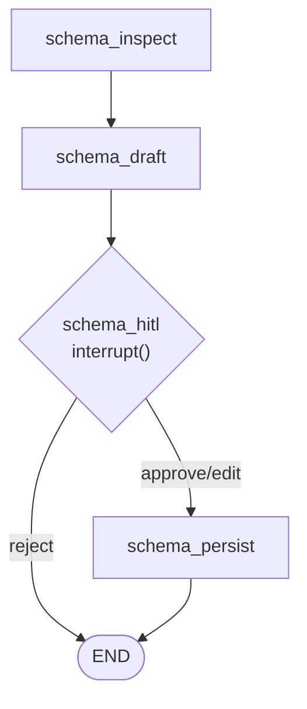

# db-multiagent-system

A **natural-language query system** over PostgreSQL built with **LangGraph**, two agents (Schema + Query), an MCP tool server, and persistent memory — evaluated on the **DVD Rental** dataset.

| Doc                    | Role                                                             |
| ---------------------- | ---------------------------------------------------------------- |
| [TASK.md](TASK.md)     | Full assignment: agents, memory, MCP, deliverables, rubric       |
| [AGENTS.md](AGENTS.md) | Repo workflow: `uv`, safety rules, Git conventions, verification |

---

## Architecture

The repo ships **two compiled LangGraph workflows** in [`src/graph/graph.py`](src/graph/graph.py): **`get_compiled_schema_graph()`** (schema agent) and **`get_compiled_query_graph()`** (query agent). Each uses an in-process **`MemorySaver`** checkpointer for HITL and thread state. **Streamlit** ([`src/ui/app.py`](src/ui/app.py)) runs **both** graphs on separate tabs. The **CLI** ([`main.py`](main.py)) runs **only the query graph** and prints a reminder to approve schema docs via the Schema tab first.

LLM calls go through **LiteLLM** via **`ChatLiteLLM`**. Read-only access to the **DVD Rental** database is via an **MCP** server (streamable HTTP) and **`MultiServerMCPClient`** from **`langchain-mcp-adapters`**. Persisted app state (approved schema docs + user preferences) lives in a **separate Postgres** (`app_memory`, Compose port **5433**); the MCP tools target the dataset DB on **5432**.

**Logical gate (product flow):** until approved schema documentation exists in `app_memory`, the Streamlit **Query** tab shows a blocker (no chat) until you complete the Schema flow; the CLI does not hard-block but should only be used after schema setup for reliable answers.

**Compose topology** (three services): `postgres` (dvdrental), `mcp-server` (tools against dvdrental), `postgres-app-memory` (app_memory). Configure via [`.env.example`](.env.example).

---

## Quick start

```bash
uv sync
docker compose up -d
cp -n .env.example .env
```

Run the CLI:

```bash
uv run python main.py
```

Run the UI:

```bash
uv run streamlit run src/ui/app.py
```

---

## Configuration

All configuration (Postgres, MCP server, LiteLLM) is via environment variables. See [`.env.example`](.env.example).

---

## Agent patterns used

- **Human-in-the-loop (HITL)**: schema descriptions are reviewed and explicitly approved before persisting.
- **Planner / executor**: the query flow plans (intent + tables) before generating/executing SQL.
- **Critic / validator**: generated SQL is validated before execution and can trigger retries.

---

## MCP tools (and role)

- **`inspect_schema`**: reads DB metadata (tables, columns, keys, relationships) for the Schema agent.
- **`execute_readonly_sql`**: executes **read-only** SQL against the DVD Rental database for the Query agent.

---

## Memory design

- **Persistent memory (cross-session)**: Postgres `app_memory` stores approved schema descriptions and user preferences.
- **Short-term memory (session)**: LangGraph `MemorySaver` stores conversation context and graph state per `thread_id`.

---

## Query agent graph (LangGraph)


---

## Schema agent graph (LangGraph)


