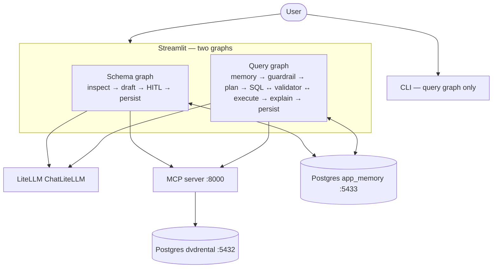
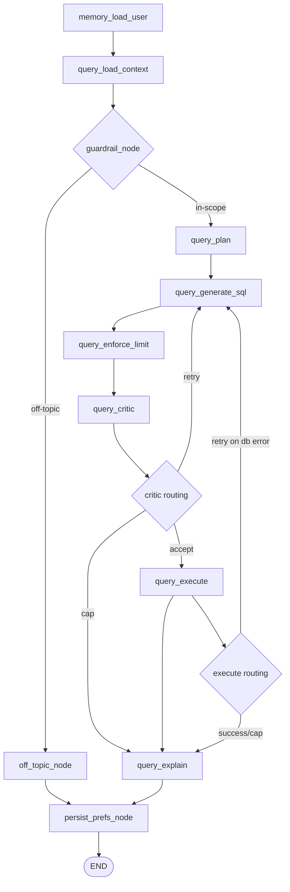

# db-multiagent-system

A **natural-language query system** over PostgreSQL built with **LangGraph**, two agents (Schema + Query), an MCP tool server, and persistent memory — evaluated on the **DVD Rental** dataset.

| Doc                    | Role                                                             |
| ---------------------- | ---------------------------------------------------------------- |
| [TASK.md](TASK.md)     | Full assignment: agents, memory, MCP, deliverables, rubric       |
| [AGENTS.md](AGENTS.md) | Repo workflow: `uv`, safety rules, Git conventions, verification |

---

## Architecture

The repo ships **two compiled LangGraph workflows** in [`src/graph/graph.py`](src/graph/graph.py): **`get_compiled_schema_graph()`** (schema agent) and **`get_compiled_query_graph()`** (query agent). Each uses an in-process **`MemorySaver`** checkpointer for HITL and thread state. **Streamlit** ([`src/ui/app.py`](src/ui/app.py)) runs **both** graphs on separate tabs. The **CLI** ([`main.py`](main.py)) runs **only the query graph** and prints a reminder to approve schema docs via the Schema tab first.

LLM calls go through **LiteLLM** via **`ChatLiteLLM`**. Read-only access to the **DVD Rental** database is via an **MCP** server (streamable HTTP) and **`MultiServerMCPClient`** from **`langchain-mcp-adapters`**. Persisted app state (approved schema docs + user preferences) lives in a **separate Postgres** (`app_memory`, Compose port **5433**); the MCP tools target the dataset DB on **5432**.



**Logical gate (product flow):** until approved schema documentation exists in `app_memory`, the Streamlit **Query** tab shows a blocker (no chat) until you complete the Schema flow; the CLI does not hard-block but should only be used after schema setup for reliable answers.

**Compose topology** (three services): `postgres` (dvdrental), `mcp-server` (tools against dvdrental), `postgres-app-memory` (app_memory). Configure **`LLM_SERVICE_URL`** and **`MCP_SERVER_URL`** on the host (see [Environment variables](#environment-variables)).

---

## Prerequisites

- **Python** `>=3.12` (see `.python-version` / `pyproject.toml`)
- **[uv](https://github.com/astral-sh/uv)** for environments and dependencies
- **Docker** for PostgreSQL (**dvdrental** + **app_memory**) and the **MCP** server container

---

## Quick start

### 1. Install dependencies

```bash
uv sync
```

### 2. Start Docker services

`docker compose up -d` brings up **three** services: `postgres` (DVD Rental on **5432**), `postgres-app-memory` (app state on **5433**), and `mcp-server` (MCP tools on **8000**).

```bash
docker compose up -d
```

Wait until the Postgres containers report healthy (names contain `multiagent`):

```bash
docker ps --filter name=multiagent
```

The **`app_memory`** database needs no manual migration: `user_preferences` and `schema_docs` tables are created with `CREATE TABLE IF NOT EXISTS` the first time the stores are used.

### 3. Configure environment

```bash
cp -n .env.example .env
# Edit .env if your host/port/credentials differ from the Compose defaults
```

### 4. Run

```bash
# Interactive REPL
uv run python main.py

# One-shot question, then drop into REPL
uv run python main.py -q "Show me the top 5 most rented films"

# Single non-interactive question via stdin
echo "How many customers are there?" | uv run python main.py

# Skip the Postgres connectivity check
uv run python main.py --no-bootstrap

# Fixed LangGraph thread (checkpoints / session); overrides DEFAULT_THREAD_ID
uv run python main.py --thread-id my-cli-session -q "How many films?"
```

Use **Streamlit** (Schema agent tab) to generate and approve schema documentation before asking questions in the **Query agent** tab. The CLI (`main.py`) runs only the **query** graph and does not run the schema pipeline—complete schema HITL in the UI (or ensure `app_memory.schema_docs` is already approved) before relying on CLI answers.

### 5. Streamlit UI

The app has two sections (**Schema agent** / **Query agent**). Each uses its own compiled LangGraph, checkpointing, and `graph_run_config(..., run_kind="streamlit")`. The Schema tab runs inspect → draft → HITL (approve, edit JSON, or reject) on demand. The Query tab is guardrailed for DVD Rental scope, handles success/failure/off-topic outcomes, and is disabled until schema docs exist in app memory, with a shortcut to open the Schema tab.

```bash
uv run streamlit run src/ui/app.py
```

Use the same `.env` / Docker setup as above. Optional: set **`DEFAULT_THREAD_ID`** for the query chat thread. **New query chat** / **New schema session** in the sidebar reset the respective thread ids and messages.

---

## Environment variables

| Variable                                                      | Purpose                                                                         |
| ------------------------------------------------------------- | ------------------------------------------------------------------------------- |
| `POSTGRES_HOST`                                               | DVD Rental DB host (e.g. `localhost`)                                           |
| `POSTGRES_PORT`                                               | DVD Rental DB port (`5432` in Compose)                                          |
| `POSTGRES_USER`                                               | DB user (`postgres` in Compose)                                                 |
| `POSTGRES_PASSWORD`                                           | DB password                                                                     |
| `POSTGRES_DB`                                                 | Must be **`dvdrental`**                                                         |
| `APP_MEMORY_HOST`                                             | App memory DB host (e.g. `localhost`)                                           |
| `APP_MEMORY_PORT`                                             | App memory DB port (`5433` in Compose)                                          |
| `APP_MEMORY_USER` / `APP_MEMORY_PASSWORD` / `APP_MEMORY_DB`   | Credentials and database name **`app_memory`**                                  |
| `MCP_HOST`                                                    | MCP server bind host (client-side; container uses `0.0.0.0`)                    |
| `MCP_PORT`                                                    | MCP server port (default `8000`)                                                |
| `MCP_SERVER_URL`                                              | Full MCP client URL (e.g. `http://127.0.0.1:8000/mcp`)                          |
| `LLM_SERVICE_URL`                                             | LiteLLM proxy root URL                                                          |
| `LLM_API_KEY`                                                 | API key for the LiteLLM proxy                                                   |
| `LLM_MODEL`                                                   | Model id as routed by LiteLLM                                                   |
| `LLM_TEMPERATURE` / `LLM_TIMEOUT_SECONDS` / `LLM_MAX_RETRIES` | Sampling, HTTP timeout, and retries for `ChatLiteLLM` (see `.env.example`)      |
| `QUERY_MAX_REFINEMENTS`                                       | Shared cap for validator rejects and DB-execution retries (default `3`)         |
| `PERSIST_PREFS_TIMEOUT_MS`                                    | Timeout (ms) for terminal preferences persistence before background scheduling   |
| `DEFAULT_USER_ID` / `DEFAULT_THREAD_ID`                       | Memory + LangGraph thread defaults                                              |
| `LANGSMITH_*`                                                 | Optional tracing to LangSmith ([Observability](#observability-langsmith) below) |

See [`.env.example`](.env.example) for all defaults.

---

## Observability (LangSmith)

Set tracing env vars (see [.env.example](.env.example)), then run a CLI question so LangGraph emits a trace:

```bash
export LANGSMITH_TRACING=true
export LANGSMITH_API_KEY=your_key_here
export LANGSMITH_PROJECT=dvdrental-local
uv run python main.py -q "How many actors are there?"
```

Open your [LangSmith](https://smith.langchain.com/) project (same name as `LANGSMITH_PROJECT`, default `dvdrental-local` in `.env.example`) and inspect the run tree: graph nodes, LLM calls, and MCP tools such as `execute_readonly_sql` nested under the same invocation. Use `LANGSMITH_ENDPOINT` only for EU or self-hosted deployments.

Filter runs using trace metadata **`run_kind`** (`streamlit`, `cli`, or `pytest` depending on entrypoint).

The CLI still emits **errors and warnings** to stderr; LangSmith remains the primary place for full run trees and spans.

---

## Project layout

```text
.
├── main.py                      # CLI: Postgres bootstrap + LangGraph REPL / HITL resume (dev/testing)
├── pyproject.toml               # uv / hatch packages under src/*, Ruff, pytest markers
├── uv.lock
├── docker-compose.yml           # postgres:18 (dvdrental), postgres-app-memory, mcp-server
├── Dockerfile                   # Image for mcp-server
├── .pre-commit-config.yaml      # Optional git hooks (Ruff)
├── TASK.md / AGENTS.md          # Assignment + repo agent rules
├── db/
│   ├── dvdrental.tar            # DVD Rental dataset archive
│   └── restore-dvdrental.sh     # Init script mounted into the dvdrental container
├── specs/                       # Incremental design notes (spec-driven)
├── src/
│   ├── agents/
│   │   ├── query_agent.py       # Structured LLM: plan + SQL + critic (QueryPlanOutput, …)
│   │   ├── schema_agent.py      # Structured LLM: SchemaDraftOutput
│   │   ├── prompts/             # Prompt strings (query, schema)
│   │   └── schemas/             # Pydantic output models
│   ├── config/                  # pydantic-settings: postgres, app memory, MCP, LLM
│   ├── graph/
│   │   ├── graph.py             # Two graphs: schema + query; MemorySaver; graph_run_config()
│   │   ├── invoke_v2.py         # unwrap_query_graph_v2 / unwrap_schema_graph_v2 (version="v2")
│   │   ├── state.py             # SchemaGraphState, QueryGraphState (+ sub-models)
│   │   ├── presence.py          # DbSchemaPresence — schema_docs readiness (Streamlit sidebar / tab gate)
│   │   ├── nodes/
│   │   │   ├── schema_nodes/    # schema_inspect, schema_draft, schema_hitl, schema_persist
│   │   │   └── query_nodes/     # guardrail, planner, sql/critic/execute, explain, persist
│   │   ├── memory_nodes.py      # memory_load_user
│   │   └── mcp_helpers.py       # MultiServerMCPClient + tool result helpers
│   ├── llm/
│   │   └── factory.py           # create_chat_llm() → ChatLiteLLM (LiteLLM-compatible API)
│   ├── memory/
│   │   ├── db.py                # Connect to app_memory database
│   │   ├── schema_docs.py       # Persisted approved schema descriptions
│   │   ├── preferences.py       # User preferences store
│   │   └── session.py           # Session snapshot helpers
│   ├── mcp_server/
│   │   ├── main.py              # FastMCP Streamable HTTP entry
│   │   ├── tools.py             # inspect_schema, execute_readonly_sql
│   │   ├── readonly_sql.py      # Read-only SQL guard
│   │   └── schema_metadata.py   # information_schema introspection
│   ├── ui/
│   │   ├── app.py               # Streamlit: Schema + Query tabs (query graph same as CLI)
│   │   └── formatters.py        # Markdown helpers for query answers / errors
│   └── utils/
│       └── postgres.py          # Shared psycopg helpers
└── tests/                       # pytest (unit + integration markers)
```

First-party imports use top-level package names from `src/` (`config`, `graph`, `agents`, …) as configured in `pyproject.toml`.

---

## How it works

### Schema readiness and the two graphs

**Streamlit** calls **`DbSchemaPresence.check()`** (backed by [`src/graph/presence.py`](src/graph/presence.py) and `schema_docs.ready` in Postgres) for the sidebar status and to **block the query chat** (early return in the Query tab) until approved documentation exists.

**Query graph** runs do not branch on presence at `START`. Instead, **`memory_load_user`** loads the approved payload into `query.docs_context`, or sets **`docs_warning`** (e.g. missing or unapproved docs). Downstream nodes use `docs_context` when present; run the **schema graph** from the Schema tab to produce and approve docs (`schema_inspect` → … → `schema_persist` in [`src/graph/nodes/schema_nodes/`](src/graph/nodes/schema_nodes/)). That path inspects the live DB via MCP (`inspect_schema`), drafts descriptions, **pauses with `interrupt()`** for approval, then persists to `app_memory`.

### Query pipeline

Wiring lives in [`src/graph/graph.py`](src/graph/graph.py) (there is no separate `query_pipeline.py` module).



1. **`memory_load_user`** — loads user preferences and approved schema docs from the **`app_memory`** Postgres database into state.
2. **`query_load_context`** — seeds query-specific state fields.
3. **`guardrail_node`** — classifies whether the prompt is about the DVD Rental dataset and short-circuits out-of-scope requests.
4. **`off_topic_node`** _(conditional)_ — returns a safe canned response for out-of-scope prompts and exits through terminal persistence.
5. **`query_plan`** — LLM produces a structured query plan (tables, joins, filters) and infers preference deltas in the same node.
6. **`query_generate_sql`** — LLM generates the SQL (informed by plan + schema docs + optional critic feedback).
7. **`query_enforce_limit`** — uses **sqlglot** to inject or tighten the SQL `LIMIT` to the user's `row_limit_hint` preference.
8. **`query_critic`** — validates SQL (read-only, `LIMIT` present) and runs a semantic LLM critique; `safety_strictness` controls how verdicts and risk flags are interpreted.
9. **Critic routing** — if the critic accepts, go to **`query_execute`**. If it rejects and `refinement_count` is below **`QUERY_MAX_REFINEMENTS`**, loop back to **`query_generate_sql`**. If the cap is reached, go to **`query_explain`** in failure mode.
10. **`query_execute`** — sends accepted SQL to the MCP `execute_readonly_sql` tool.
11. **Execute routing** — on DB/tool failure under cap, loop back to **`query_generate_sql`** with MCP error feedback; on success/cap go to **`query_explain`**.
12. **`query_explain`** — emits `query_answer` (success) or `query_failure` (max attempts / DB failure); off-topic is already set by `off_topic_node`.
13. **`persist_prefs_node`** — terminal node that snapshots session history and persists inferred preference deltas with timeout-based background fallback.

### Safety

- Only `SELECT` statements with a `LIMIT` clause reach the database.
- The MCP server's `execute_readonly_sql` independently rejects any statement containing write/admin tokens (`INSERT`, `UPDATE`, `DELETE`, `DROP`, `ALTER`, `CREATE`, …).
- Schema docs are **never written without human approval** (HITL `interrupt()`).

---

## Memory

The system implements **two distinct memory layers**, each with a different scope and backend.

### Persistent memory — cross-session, per-user

**Backend:** PostgreSQL `app_memory` database (port 5433), managed by `src/memory/preferences.py` and `src/memory/schema_docs.py`.

| Table              | Key                 | What is stored                                          | Why                                                                                                                                |
| ------------------ | ------------------- | ------------------------------------------------------- | ---------------------------------------------------------------------------------------------------------------------------------- |
| `user_preferences` | `user_id` (TEXT PK) | JSONB blob of preference keys                           | User preferences must survive process restarts and be applied on every subsequent query without the user having to re-specify them |
| `schema_docs`      | Singleton (`id=1`)  | JSONB: approved table/column descriptions + fingerprint | Schema documentation is expensive to generate (LLM + HITL) and stable; it is shared across all users and sessions                  |

**User preference keys** and how each shapes system behaviour:

| Key                  | Default     | Effect                                                                                                                                                                                                              |
| -------------------- | ----------- | ------------------------------------------------------------------------------------------------------------------------------------------------------------------------------------------------------------------- |
| `preferred_language` | `"en"`      | `query_explain` instructs the LLM to write the explanation in this language                                                                                                                                         |
| `output_format`      | `"table"`   | `query_explain` sets `last_result["output_format"]`; formatters branch between a markdown pipe table (`"table"`) and a fenced JSON block (`"json"`)                                                                 |
| `date_format`        | `"ISO8601"` | `query_explain` reformats date/timestamp values in result rows before returning (`"US"` → MM/DD/YYYY, `"EU"` → DD/MM/YYYY)                                                                                          |
| `safety_strictness`  | `"normal"`  | `query_critic` applies different thresholds: `strict` blocks on any critic risk even with an `accept` verdict; `normal` blocks only on explicit `reject`; `lenient` always passes through with a warning annotation |
| `row_limit_hint`     | `10`        | `query_enforce_limit` uses sqlglot to inject or tighten the SQL `LIMIT` clause before the critic sees the SQL (clamped 1–500)                                                                                       |

**How preferences change:** `query_plan` concurrently infers persistent preference deltas from the user's message. Deltas are not reviewed by HITL in the query graph; they are persisted in `persist_prefs_node` via `UserPreferencesStore.patch()` (JSONB merge) at the end of the turn.

### Short-term memory — session-scoped, in-process

**Backend:** LangGraph `MemorySaver` checkpointer (in-process, keyed by `thread_id`). Lost on process restart — intentional, since this is conversational context not durable state.

| Field                               | Location in state     | What is stored                                                                                                                               | Why                                                                                                                                                        |
| ----------------------------------- | --------------------- | -------------------------------------------------------------------------------------------------------------------------------------------- | ---------------------------------------------------------------------------------------------------------------------------------------------------------- |
| `memory.conversation_history`       | `MemoryState`         | List of up to 5 `ConversationTurn` objects: user question, SQL, row count, row preview (≤3 rows, values truncated to 200 chars), explanation | Enables the LLM to resolve pronoun references ("his movies", "those actors") and reuse joins/filters from prior turns without re-reading state from the DB |
| `memory.preferences`                | `MemoryState`         | Mirror of the current user's persisted preferences, loaded fresh at the start of every turn                                                  | Avoids repeated DB reads within a turn; all pipeline nodes read from state rather than querying `app_memory` directly                                      |
| `memory.preferences_proposed_delta` | `MemoryState`         | Candidate preference update inferred during planning                                                                                         | Carries the delta from `query_plan` to terminal `persist_prefs_node`                                                                                       |
| `query.*`                           | `QueryPipelineState`  | Plan, generated SQL, critic status, execution result, explanation                                                                            | Pipeline nodes write and read intermediate results; cleared at the start of each new query turn                                                            |
| `schema_pipeline.*`                 | `SchemaPipelineState` | Metadata, draft, HITL-approved doc                                                                                                           | Schema pipeline nodes write and read intermediate results                                                                                                  |

**Conversation history cap** is enforced in `src/memory/session.py`: `HISTORY_MAX_TURNS = 5`, `HISTORY_ROWS_PREVIEW = 3`, `HISTORY_ROW_VALUE_MAX_CHARS = 200`. The cap prevents unbounded token growth in LLM prompts while retaining enough recent context for multi-turn refinement.

---

## Tests

Pytest markers are defined in `pyproject.toml`: **`integration`** (Postgres / docker), **`litellm_integration`** (needs `LLM_*` and a reachable LiteLLM proxy).

```bash
# Full suite (integration tests skip if Postgres is unreachable)
uv run pytest tests/ -q

# Integration tests only (needs live dvdrental + app_memory as in README / Compose)
uv run pytest -m integration -q

# Optional: LLM proxy tests (skipped unless env is configured)
uv run pytest -m litellm_integration -q
```

---

## Lint and format

```bash
uv run ruff check .
uv run ruff format .
```

Optional: install [pre-commit](https://pre-commit.com/) hooks from `.pre-commit-config.yaml` with `uv run pre-commit install` so Ruff runs on commit.

---

## Adding dependencies

Use **uv** — do not edit `pyproject.toml` by hand:

```bash
uv add <package>
uv add --dev <package>
```
