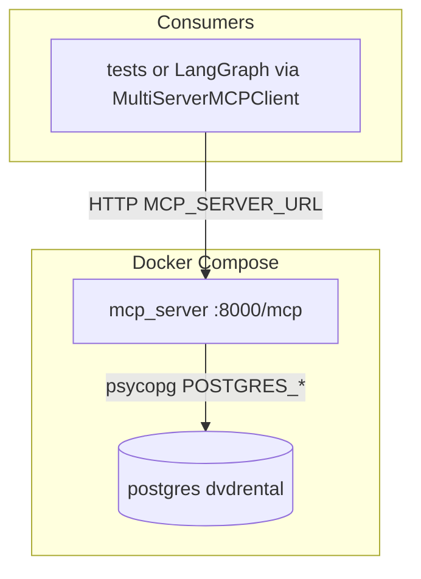

# Spec 02 — MCP tools (schema + read-only SQL)

**Sources of truth:** [TASK.md](../TASK.md), [AGENTS.md](../AGENTS.md). Define **MCP tool surface and packaging** for PostgreSQL against **`dvdrental`**. Build on [specs/01-bootstrap.md](01-bootstrap.md), do not supersede it.

---

## 1. Purpose

Deliver **MCP-exposed tools**:

1. **Schema inspection:** Return **real PostgreSQL metadata** from **`dvdrental`** (tables, columns, types; primary/foreign keys, constraints **where available** via `information_schema` / `pg_catalog`).
2. **Read-only SQL execution:** **Execute read-only SQL** only. Reject statements with forbidden tokens. Enforce **`LIMIT`** on queries. Return structured success/error payloads.

**Outcome:** Postgres up + creds configured → MCP server expose tools over **streamable HTTP** (default **port 8000**, path **`/mcp`**). Log tool invocations (name, outcome, timing; no secrets). Verify via **pytest** and/or minimal client using **`MultiServerMCPClient`** from **`langchain-mcp-adapters`**. LangGraph binding **out of scope**.

---

## 2. Scope

| In scope | Out of scope |
| --- | --- |
| MCP server under `src/mcp_server/`, tool implementations, logging | LangGraph `StateGraph`, agent state, routing |
| Tools: `inspect_schema`, `execute_readonly_sql` (document final names if prefixed) | Schema Agent prompts, HITL, persist descriptions |
| Read-only SQL validation aligned with [AGENTS.md](../AGENTS.md) | Persistent / short-term memory |
| `uv add` for `mcp`, optional `langchain-mcp-adapters` | Streamlit UI, HTTP API for full app |
| Docker Compose **extension**: `mcp-server` service depends on healthy `postgres` | Query Agent, NL→SQL, extra critic/validator |
| Tests (inc `@pytest.mark.integration` for live DB) | LiteLLM / LLM config |

---

## 3. Architecture (process boundaries)

### 3.1 Separate MCP server process

Follow **Model Context Protocol (MCP)** pattern:

- **One process** run **MCP server**: register tools, accept connections, execute handlers (Postgres I/O here).
- **Other code** (tests, LangGraph nodes) do **not** reimplement tools locally. Connect as **MCP client**, discover tools, invoke. Library modules shareable, but **integration surface** required by [TASK.md](../TASK.md) is **MCP tools**.

Avoid duplicate DB creds + business rules. Match **`langchain-mcp-adapters`** remote server expectations.

### 3.2 Transport: streamable HTTP

Use Python MCP SDK **streamable-http** transport:

- **Port:** `8000` default (configurable via `MCP_PORT`).
- **Path:** **`/mcp`**.
- **Bind address:** Docker bind **`0.0.0.0`**; host dev bind **`127.0.0.1`** (document choice).

Host clients:

- `http://127.0.0.1:8000/mcp` or `http://localhost:8000/mcp`

Compose service clients:

- `http://mcp-server:8000/mcp` (Compose DNS name `mcp-server` in §7)

### 3.3 Monorepo layout (single `pyproject.toml`)

**Single uv project** at repo root ([AGENTS.md](../AGENTS.md)). Implement MCP server as **normal package** under `src/mcp_server/`. List in Hatch wheel packages (§3.4). Do **not** use second `pyproject.toml`.

### 3.4 Target repository layout

```text
db_multiagent_system/
  pyproject.toml
  uv.lock
  docker-compose.yml          # postgres + mcp-server (see §7)
  .env.example
  src/
    config/                   # existing: pydantic-settings (POSTGRES_*)
    mcp_server/               # NEW: MCP server package (importable as `mcp_server`)
      __init__.py
      __main__.py             # optional: uv run python -m mcp_server
      main.py                 # streamable-http server entry: bind, mount MCP app, run
      tools.py                # register MCP tools; delegates to helpers
      schema_metadata.py      # SQL/information_schema queries
      readonly_sql.py         # token guard + execute wrapper
    db_multiagent_system/     # existing bootstrap
  tests/
    test_mcp_*.py             # integration/unit per team preference
  specs/
    02-tools-mcp.md           # this file
```

**`main.py` responsibilities:**

1. Load settings (Postgres + MCP options).
2. Construct MCP **server** + **register** tool handlers (`inspect_schema`, `execute_readonly_sql`).
3. Start HTTP app serving **streamable-http** at **`/mcp`** on **`MCP_PORT`**.

Imports match **`mcp`** package version docs for **streamable-http**.

**Hatch / packaging:** Add `src/mcp_server` to `[tool.hatch.build.targets.wheel] packages=` in [pyproject.toml](../pyproject.toml).

**Current `pyproject.toml`:**

```toml
[tool.hatch.build.targets.wheel]
packages = ["src/db_multiagent_system", "src/config"]
```

**Updated:**

```toml
[tool.hatch.build.targets.wheel]
packages = ["src/db_multiagent_system", "src/config", "src/mcp_server"]
```

**Rule:** **Metadata queries** + **read-only validation** logic live in **`src/mcp_server/`** (e.g. `schema_metadata.py`, `readonly_sql.py`). **`mcp_server/tools.py`** register handlers + delegate.

---

## 4. Python toolchain

- **Python:** `>=3.12` ([pyproject.toml](../pyproject.toml)).
- **Package manager:** **uv** only; **do not** hand-edit deps ([AGENTS.md](../AGENTS.md)).

**Runtime deps:**

- **`uv add mcp`** — official **Model Context Protocol** SDK. See [Model Context Protocol Python SDK documentation](https://modelcontextprotocol.io/python/).
- **`uv add langchain-mcp-adapters`** — provide **`MultiServerMCPClient`** for tests/LangGraph **`await client.get_tools()`**.

**If MCP SDK need extra ASGI packages**, use **`uv add`**.

**Dev deps:** existing Ruff/pytest. Add helpers with `uv add --dev`.

---

## 5. MCP server specification

### 5.1 Transport and endpoint (summary)

| Item | Value |
| --- | --- |
| Transport | **streamable-http** (MCP Python SDK) |
| Default port | **8000** (`MCP_PORT`) |
| HTTP path | **`/mcp`** |
| Client env | **`MCP_SERVER_URL`** — full URL with path |

**URLs:**

- **Host**: `http://127.0.0.1:8000/mcp` or `http://localhost:8000/mcp`.
- **Compose service**: `http://mcp-server:8000/mcp` if named `mcp-server`.

### 5.2 Tool: `inspect_schema`

**Purpose:** Return schema metadata for **`dvdrental`** (optionally filter schema/table).

**Inputs:**

- `schema_name` (optional): PostgreSQL schema. Default `public` or document behavior.
- `table_name` (optional): filter table.

**Output:** Structured data (dict/list). Include table, column, data type, nullability, PK/FK references if available.

**Notes:**

- Query **`information_schema`** (+ **`pg_catalog`** for PK/FK) using **`psycopg`** with [config.Settings](../src/config/settings.py) / `POSTGRES_*`.
- Filter catalog queries to prevent huge results.

**Errors:** Return clear message if DB unreachable/query fails. Use **Error Response Format** (§5.3).

### 5.3 Tool: `execute_readonly_sql`

**Purpose:** Run **single** read-only statement, return **limited** row preview.

**Input:**

- `sql` (string): user/agent SQL.

**Pre-execution validation:**

- Reject normalized statement containing **forbidden** tokens ([AGENTS.md](../AGENTS.md)):

  `INSERT`, `UPDATE`, `DELETE`, `TRUNCATE`, `DROP`, `ALTER`, `CREATE`, `GRANT`, `REVOKE`, `VACUUM`, `ANALYZE`, `COPY`, `DO`, `CALL`, `EXECUTE`

- **Allow only** read-only intent. **`SELECT`** minimum.
- Reject multi-statement input. Accept **one SQL statement per invocation**. Return error if multiple statements found.

**Multi-statement rejection:**

```json
{
  "success": false,
  "error": {
    "type": "validation_error",
    "message": "Multi-statement SQL not supported. Please submit one statement at a time."
  }
}
```

**LIMIT policy:**

- **Default LIMIT:** `1000` rows.
- **Absolute maximum:** Enforce `LIMIT 1000`.
- **Application capping:** Return requested rows if safe, indicate truncation in response.

**Output:**

- Column names, ≤ **1000** rows. Structured metadata: `rows_returned`, `rows_truncated`, `limit_enforced`.
- Row count or truncation flag. Structured error on validation/DB failure.

**Success Response Format:**

```json
{
  "success": true,
  "columns": ["customer_id", "first_name", "email"],
  "rows": [
    {"customer_id": 1, "first_name": "Mary", "email": "mary@example.com"},
    ...
  ],
  "rows_returned": 10,
  "rows_truncated": false,
  "limit_enforced": 1000
}
```

**Error Response Format:**

```json
{
  "success": false,
  "error": {
    "type": "validation_error" | "database_error" | "connection_error",
    "message": "Human-readable error message",
    "details": "Optional: truncated SQL, constraint violated, or PG error code"
  }
}
```

**Error Examples:**

- Forbidden token: `{"success": false, "error": {"type": "validation_error", "message": "Query contains forbidden token: DELETE"}}`
- DB unreachable: `{"success": false, "error": {"type": "connection_error", "message": "Cannot connect to dvdrental database. Verify POSTGRES_HOST and POSTGRES_PORT."}}`
- Multi-statement: `{"success": false, "error": {"type": "validation_error", "message": "Multi-statement SQL not supported. Please submit one statement at a time."}}`

**Logging:** Log truncated SQL, not passwords ([AGENTS.md](../AGENTS.md)).

**SQL Logging Format:**

Never log `POSTGRES_PASSWORD`.

- **Truncate:** Log first 200 chars + `[... truncated]`.
- **Never log** sensitive data queries.
- **Format:** timestamp, duration, status, query preview.

**Example log entry:**

```text
INFO: MCP tool_call | name=execute_readonly_sql | input_sql_preview="SELECT * FROM film WHERE title LIKE $1 LIMIT 100" | duration_ms=45 | status=success | rows_returned=10
```

**Validation failure log:**

```text
INFO: MCP tool_call | name=execute_readonly_sql | input_sql_preview="DELETE FROM film WHERE film_id = $1" | duration_ms=2 | status=validation_error | error_type=forbidden_token
```

### 5.4 Where tool logic lives

**Business logic** runs **inside MCP server process**: connection with **`config.Settings`** / `POSTGRES_*`, **psycopg**. LangGraph code must **not** reimplement SQL execution ([TASK.md](../TASK.md)).

---

## 6. Configuration

### 6.1 Database

Same variables as [specs/01-bootstrap.md](01-bootstrap.md) §6:

| Variable | Meaning | Example | Required |
| --- | --- | --- | --- |
| `POSTGRES_HOST` | TCP host | `localhost` / `postgres` | Yes |
| `POSTGRES_PORT` | TCP port | `5432` | Yes |
| `POSTGRES_USER` | DB role | `postgres` | Yes |
| `POSTGRES_PASSWORD` | DB password | (document in `.env.example`) | Yes |
| `POSTGRES_DB` | Database name | **`dvdrental`** | Yes |

**Must use `dvdrental`** ([TASK.md](../TASK.md)).

### 6.2 MCP server listen + client URL

| Variable | Meaning | Example |
| --- | --- | --- |
| `MCP_HOST` | Bind address for MCP HTTP | `0.0.0.0` |
| `MCP_PORT` | Port | `8000` |
| `MCP_SERVER_URL` | URL for **clients** | `http://localhost:8000/mcp` |

Document keys in **`.env.example`**.

---

## 7. Docker Compose

Update [docker-compose.yml](../docker-compose.yml) with **`mcp-server`** service:

- **Build/image**: Dockerfile running MCP entrypoint (`uv run python -m mcp_server` or equivalent).
- **Ports:** map **`8000:8000`**.
- **Depends on:** **`postgres`** using **`condition: service_healthy`**.
- **Environment:**
  - `POSTGRES_HOST=postgres`
  - `POSTGRES_PORT=5432`, `POSTGRES_USER`, `POSTGRES_PASSWORD`, `POSTGRES_DB=dvdrental`.
  - `MCP_HOST=0.0.0.0`, `MCP_PORT=8000`.
- **Network:** Default Compose network resolve **`postgres`**.

**Example:**

```yaml
services:
  mcp-server:
    build: .
    ports:
      - "8000:8000"
    environment:
      POSTGRES_HOST: postgres
      POSTGRES_PORT: 5432
      POSTGRES_USER: postgres
      POSTGRES_PASSWORD: mysecretpassword
      POSTGRES_DB: dvdrental
      MCP_HOST: 0.0.0.0
      MCP_PORT: 8000
    depends_on:
      postgres:
        condition: service_healthy
```

**Require service name:** **`mcp-server`** for Compose DNS resolution.

Optional: **volume-mount** `src/` for dev reload. Document in README.

Keep **`postgres`** + **`dvdrental`** restore behavior.

---

## 8. Observability

- **Tool calls:** Log INFO: name, duration, success/failure.
- **execute_readonly_sql:** Never log `POSTGRES_PASSWORD`. Use truncated SQL.
- **Traceability:** Meet [TASK.md](../TASK.md) observable tool usage reqs.

---

## 9. Client adapter

Use **`langchain-mcp-adapters`**:

1. Instantiate **`MultiServerMCPClient`**.
2. Pass **server config**:
   - **`transport`:** `"http"` (or `"streamable_http"`).
   - **`url`:** **`MCP_SERVER_URL`**.

**Minimal client example:**

```python
from langchain_mcp_adapters.client import MultiServerMCPClient

client = MultiServerMCPClient({
    "schema_sql": {
        "transport": "http",
        "url": "http://localhost:8000/mcp"  # adjust URL based on environment
    }
})
```

**Minimal proof:**

- **`await client.get_tools()`** return tool objects, **or**
- Integration test **invoke** `inspect_schema` / `execute_readonly_sql` via client.

**Async tests:** Use **`pytest-asyncio`** (`uv add --dev pytest-asyncio`) or `asyncio.run()`.

**No LLM required** for acceptance.

---

## 10. Acceptance criteria

1. **Schema:** `inspect_schema` return metadata for **DVD Rental** table.
2. **Read-only success:** `execute_readonly_sql` execute safe `SELECT` w/ `LIMIT`, return rows/columns.
3. **Rejection:** Forbidden token statement rejected **before** execution with clear error.
4. **Logging:** Tool invocations logged (name + outcome/duration).
5. **Compose:** `docker compose up` starts **`mcp-server`** after Postgres healthy, connects to **`dvdrental`**.
6. **Quality:** `uv run ruff check .` + `uv run ruff format .` pass. New tests pass (`uv run pytest`).
7. **Dependencies:** Only via **`uv add`** ([AGENTS.md](../AGENTS.md)).

---

## 11. Verification commands

```bash
docker compose up -d
docker compose ps
uv sync
cp -n .env.example .env
uv run pytest tests/ -q
uv run ruff check .
uv run ruff format .
```

Use **`@pytest.mark.integration`** for db integration tests ([pyproject.toml](../pyproject.toml), [tests/conftest.py](../tests/conftest.py)).

---

## 12. Implementation checklist

1. Add **`mcp`** + **`langchain-mcp-adapters`** via **`uv add`**. Update Hatch packages for `src/mcp_server`.
2. Implement **`src/mcp_server/`** modules: **metadata queries** + **read-only SQL** validation (psycopg, [config.Settings](../src/config/settings.py)).
3. Implement **`main.py`** for **streamable-http** on **port 8000**, path **`/mcp`**.
4. Register **`inspect_schema`** + **`execute_readonly_sql`** with MCP SDK. Wire logging (§8).
5. Update **`docker-compose.yml`** with **`mcp-server`** service (§7). Add **Dockerfile**. Update **`.env.example`** (§6).
6. Add tests: mock DB for token guard (`readonly_sql.py`), schema unit test (`schema_metadata.py`). Add **`@pytest.mark.integration`** tests for live **`dvdrental`** (validate forbidden reject, safe SELECT success). Optional client test via **`MultiServerMCPClient`**.
7. Run Ruff + pytest. Fix failures.

---

## 13. Prompt for coding agent

Implement `specs/02-tools-mcp.md`: MCP server in `src/mcp_server/`, **streamable-http** on **`/mcp`**, **`inspect_schema`** + **`execute_readonly_sql`** for PostgreSQL **`dvdrental`**. Read-only guardrails ([AGENTS.md](../AGENTS.md)), logging, Docker Compose **`mcp-server`** depends **`postgres`**, tests, **`uv add`** dependencies. Do **not** implement LangGraph, Schema/Query agents, HITL, memory. Use Conventional Commits.

---

## Reference diagram


