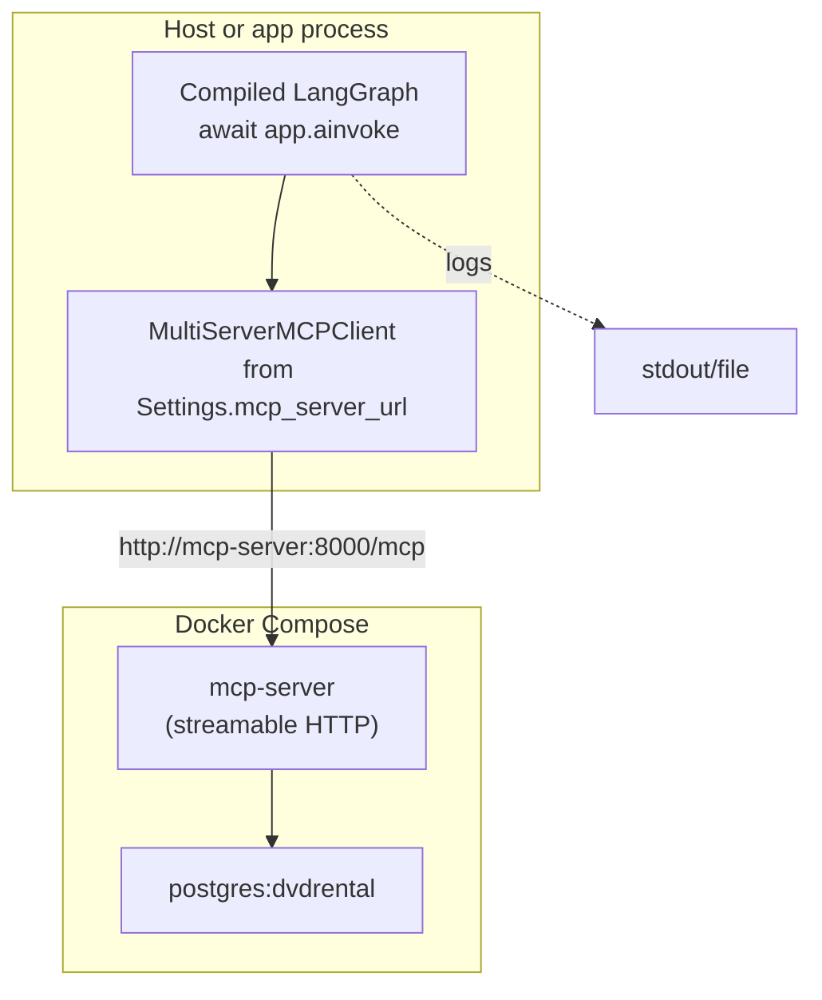

# Spec 03 — LangGraph shell (graph skeleton + shared state)

**Sources of truth:** [TASK.md](../TASK.md), [AGENTS.md](../AGENTS.md). Build on [specs/01-bootstrap.md](01-bootstrap.md) and [specs/02-tools-mcp.md](02-tools-mcp.md). **LangGraph shell** only; prior specs stay.

---

## 1. Purpose

**Minimal LangGraph** layer: **`StateGraph`**, **shared state schema**, **nodes + edges**, **`compile` / `invoke` (or `ainvoke`)**, **structured logging** — graph transitions visible in logs/tests.

**Functional outcome:**

- Compiled graph **end-to-end** from documented initial state to (`END`).
- **≥1** node hits **MCP client path** (§8): **`execute_readonly_sql`** — fixed safe `SELECT … LIMIT …` on **`dvdrental`**, or **`inspect_schema`** — no tool logic reimplemented in graph (tools on MCP server per [specs/02-tools-mcp.md](02-tools-mcp.md)).
- **Default:** **query-centric** — **query stub** = main linear path. **Schema** side **stubbed** until later specs.

---

## 2. Scope

| In scope                                                                                      | Out of scope (later / not this PR)                                            |
| --------------------------------------------------------------------------------------------- | ----------------------------------------------------------------------------- |
| `langgraph` via **`uv add langgraph`** (if not already present)                               | LiteLLM / LLM config + chat models                                            |
| `StateGraph`, shared **state** (`TypedDict` or equivalent), `compile()`, `invoke` / `ainvoke` | Full **Schema Agent** (metadata → draft → persist)                            |
| **Single linear node path:** `query_stub` calling MCP tools                                   | **HITL** approval; additional agents or routing logic                         |
| **Query stub:** **one MCP tool call** via `MultiServerMCPClient` (fixed safe SQL)             | **Query Agent** NL→SQL, critic loop, refinement                               |
| Logging: node enter/exit, transition-friendly (no secrets)                                    | Full observability rubric ([TASK.md](../TASK.md) "all traceable") as own pass |
| Unit/integration tests: compile + invoke                                                      | Persistent / short-term **memory**                                            |
| **Linear graph for demo purposes**                                                            | Streamlit, HTTP API for full app                                              |

Later specs (router/gate, schema agent + HITL, query agent + critic, memory, observability UI) **extend** shell; Spec 03 leaves repo **runnable** post-merge.

---

## 3. Target repository layout

Graph as a **top-level package** under `src/`, at the same level as `mcp_server`, `config`, and `utils`:

```text
src/
  config/
    __init__.py
    settings.py
  db_multiagent_system/
    __init__.py
    bootstrap.py          # (existing)
    mcp_demo.py           # (existing)
  graph/
    __init__.py
    state.py              # GraphState TypedDict
    graph.py              # build_graph(), get_compiled_graph()
    nodes.py              # node callables (async)
  mcp_server/
    __init__.py
    ...
  utils/
    ...
```

**Packaging:** Add **`src/graph`** to `pyproject.toml` Hatch `packages` (line 6). Update from:

```toml
packages = ["src/db_multiagent_system", "src/config", "src/mcp_server", "src/utils"]
```

to:

```toml
packages = ["src/db_multiagent_system", "src/config", "src/graph", "src/mcp_server", "src/utils"]
```

Also update `pyproject.toml` ruff isort known-first-party (line 59) to include `graph`:

```toml
known-first-party = ["config", "db_multiagent_system", "graph", "mcp_server", "utils"]
```

**Async pattern:** Nodes should be **async** for compatibility with async MCP client calls. Graph invoke via **`await app.ainvoke(...)`** or wrap in pytest-asyncio.

---

## 4. Dependencies

- **Python:** `>=3.12` ([pyproject.toml](../pyproject.toml)).
- **Runtime:** `langgraph` — add via **`uv add langgraph`** if not already in `pyproject.toml` ([AGENTS.md](../AGENTS.md): **no** hand-edit dependency arrays).
- **Transitive** (e.g. `langchain-core`) OK via lockfile.
- **Existing:** [specs/02-tools-mcp.md](02-tools-mcp.md) already includes **`langchain-mcp-adapters`** + `MultiServerMCPClient`; Spec 03 **uses** that client, no duplicate DB code.

**Acceptance:** **No LLM** required for Spec 03. Optional: document where future LLM node attaches (e.g., in a comment in `nodes.py`).

---

## 5. Configuration

Reuse **[config.Settings](../src/config/settings.py)** + env from prior specs:

|| Variable | Purpose | Notes |
|| --- | --- | --- |
|| `MCP_SERVER_URL` | Full MCP URL for graph client connection. | E.g. `http://localhost:8000/mcp` (local dev) or `http://mcp-server:8000/mcp` (Docker Compose). Matches [specs/02-tools-mcp.md](02-tools-mcp.md) §6.2. Graph nodes import this from `Settings()` to instantiate `MultiServerMCPClient`. |
|| `POSTGRES_*` | **Required by MCP server (Spec 02 deployment), not by graph nodes.** | Graph nodes do NOT import `psycopg` directly; all DB I/O flows through MCP client. The `.env` file defines these for the containerized MCP server process and for shared test fixtures. |

**Optional:** `GRAPH_DEBUG=true` — verbose node logs (enter/exit with state snapshot); document in `.env.example` if implemented.

---

## 6. LangGraph API contract (normative)

**LangGraph** + explicit state + compiled app.

**State:** `TypedDict` (`typing_extensions.TypedDict`) in `state.py`; import in `graph.py`, `nodes.py`.

**Graph build:**

- `workflow = StateGraph(GraphState)`
- `workflow.add_node("node_name", callable)`
- `workflow.add_edge(START, "first_node")` … to `END`
- `app = workflow.compile()`
- **Invocation:** `app.invoke(initial_dict)` sync; **`await app.ainvoke(initial_dict)`** if nodes are **async** (recommended for MCP client compatibility).

**Minimal pattern (illustrative — rename in impl):**

```python
from langgraph.graph import END, START, StateGraph
from typing_extensions import TypedDict


class GraphState(TypedDict, total=False):
    user_input: str
    steps: list[str]
    last_error: str | None


async def query_stub(state: GraphState) -> dict:
    return {"steps": state.get("steps", []) + ["query_stub"]}


workflow = StateGraph(GraphState)
workflow.add_node("query_stub", query_stub)
workflow.add_edge(START, "query_stub")
workflow.add_edge("query_stub", END)

app = workflow.compile()
result = await app.ainvoke({"user_input": "ping", "steps": []})
```

**Rules:**

- Document **minimum keys** in initial dict for `invoke` / `ainvoke` (e.g., `{"user_input": "...", "steps": []}`) in graph module docstring or README.
- Prefer **`START`**, **`END`** from `langgraph.graph`. `set_entry_point` etc. optional; pick one style repo-wide and use consistently.

---

## 7. State schema (minimal, forward-compatible)

Fields for **query stub** node; no full conversation memory yet.

**Required fields (`total=False` where fit):**

|| Field | Purpose | Type |
|| --- | --- | --- |
|| `user_input` | Short string for stub (echo / logged context). | `str` |
|| `steps` | Append-only list of node names / step ids (tests, logs). | `list[str]` |
|| `last_result` | Optional: tool output summary (e.g., SQL result preview). | `str \| dict \| None` |
|| `last_error` | Optional: user-safe error message if MCP call fails. | `str \| None` |

**Future:** Later specs may add **`messages`** + **`add_messages`** reducer for conversation history, additional agent routing fields, and other extensions. Spec 03 does not implement these but reserves extensibility.

---

## 8. MCP wiring from graph (no duplicate tool logic)

**Requirement:** ≥1 path instantiates **`MultiServerMCPClient`** (**`langchain-mcp-adapters`**) from `MCP_SERVER_URL` → calls **`inspect_schema`** and/or **`execute_readonly_sql`** tools ([specs/02-tools-mcp.md](02-tools-mcp.md)). **No** `psycopg` in graph nodes — all DB I/O on MCP server.

**Recommended MCP client setup (async):**

```python
from langchain_mcp_adapters.client import MultiServerMCPClient
from config import Settings

async def get_mcp_client() -> MultiServerMCPClient:
    """Async factory for MCP client (e.g., call once per graph invocation)."""
    settings = Settings()
    client = MultiServerMCPClient({
        "dvdrental": {
            "transport": "http",
            "url": settings.mcp_server_url,  # e.g. http://localhost:8000/mcp
        }
    })
    return client

# In a node:
async def query_stub(state: GraphState) -> dict:
    client = await get_mcp_client()
    tools = await client.get_tools()
    # Find and call execute_readonly_sql with fixed safe SQL
    result = await tools["execute_readonly_sql"].ainvoke({
        "sql": "SELECT 1 AS ok LIMIT 1"
    })
    return {"last_result": str(result), "steps": [...]}
```

**Read-only:** SQL to **`execute_readonly_sql`** = **fixed in code** for Spec 03 demo (e.g., `SELECT 1 AS ok`, `SELECT current_database() LIMIT 1`, `SELECT COUNT(*) FROM actor LIMIT 1`). Dynamic NL→SQL generation **out of scope**.

**Async (required pattern for this spec):**

- Nodes are **`async def`**.
- Graph invocation via **`await app.ainvoke(initial_state)`** or pytest-asyncio harness.
- Provides natural compatibility with async MCP client calls.
- Document in docstring or README why async was chosen.

---

## 9. Nodes and edges

**Linear graph:**


### Node: `query_stub` (required)

- **Purpose:** Execute a fixed safe SQL query via MCP client; demonstrate graph-to-MCP integration.
- **Implementation:**
  - Append node name to `steps`.
  - Call MCP client to execute a fixed safe SQL (e.g., `SELECT COUNT(*) FROM actor LIMIT 1`).
  - Store result summary in `last_result`.
  - Return updated state dict.

- **Logging:**
  - **Enter:** log node name, timestamp, state keys (e.g., `"Entering query_stub, steps=[...], user_input=..."`).
  - **Exit:** log node name, outcome (success/fail), result summary (no passwords; truncate long SQL if needed — see [AGENTS.md](../AGENTS.md) safety rules).
  - Use `logger.info()` with structured fields for grep-ability (e.g., include `graph_node=query_stub`, `graph_phase=enter`).

---

## 10. Logging

- **Level:** **INFO** (or **DEBUG** if `GRAPH_DEBUG=true`).
- **Content per node:**
  - **Enter:** node name, user_input (truncated if long), `steps` length.
  - **Exit:** node name, result summary (e.g., "MCP call succeeded, got X rows" or error message), `steps` updated.
- **Secrets:** Never log `POSTGRES_PASSWORD` or full SQL queries; truncate or hash if needed (see [AGENTS.md](../AGENTS.md)).
- **Grep-friendly:** Include structured fields like:

  ```python
  logger.info("Graph node transition", extra={
      "graph_node": "query_stub",
      "graph_phase": "exit",
      "steps_count": len(state["steps"]),
      "mcp_status": "success",
  })
  ```

---

## 11. Acceptance criteria

1. **Dependency added:** `langgraph` present in `pyproject.toml` (via **`uv add langgraph`** if needed); lockfile via **uv** only ([AGENTS.md](../AGENTS.md)).
2. **Graph compiles:** `StateGraph(GraphState).compile()` → `CompiledStateGraph` with no errors.
3. **`ainvoke` works:** `await app.ainvoke({"user_input": "...", "steps": []})` → returns dict matching `GraphState` keys.
4. **MCP path live:** ≥1 node successfully instantiates `MultiServerMCPClient` from `MCP_SERVER_URL` and invokes **`execute_readonly_sql`** or **`inspect_schema`** tool (when MCP + Postgres healthy).
   - Can be **unit test** (MCP mocked) or **integration test** (`@pytest.mark.integration`, live server).
5. **Tests written:** At least one test per:
   - Graph compiles.
   - Node enter/exit logging works.
   - MCP tool call succeeds (mocked or live).
6. **Lint clean:** `uv run ruff check . && uv run ruff format .` passes on all new/changed code.
7. **Conventional Commits:** All commits follow `feat(...)`, `fix(...)`, `test(...)` format ([AGENTS.md](../AGENTS.md) Git conventions).

---

## 12. Verification commands

```bash
# Start services
docker compose up -d

# Ensure healthy
docker ps --filter name=multiagent-postgres
docker ps --filter name=multiagent-mcp-server

# Install/sync
uv sync

# Copy env template
cp -n .env.example .env

# Run tests (units skip MCP if no server; integration needs docker compose up)
uv run pytest tests/ -q
uv run pytest -m integration -q

# Lint
uv run ruff check .
uv run ruff format .
```

---

## 13. Implementation checklist

1. ✅ **Update `pyproject.toml`:**
   - Add `"src/graph"` to Hatch `packages` (line 6).
   - Add `"graph"` to ruff isort `known-first-party` (line 59).
2. ✅ **`uv add langgraph`** (if not present).
3. ✅ **Create `src/graph/`** package: `__init__.py`, `state.py`, `graph.py`, `nodes.py`.
4. ✅ **Define `GraphState`** (TypedDict) in `state.py` with fields: `user_input`, `steps`, `last_result`, `last_error`.
5. ✅ **Build graph** in `graph.py`: `StateGraph(GraphState)` → add `query_stub` node → add edges START → query_stub → END.
6. ✅ **Implement `query_stub` node** (async): get `MCP_SERVER_URL` from Settings, instantiate `MultiServerMCPClient`, call `execute_readonly_sql` with fixed safe SQL (e.g., `SELECT 1 LIMIT 1`), log enter/exit, return updated state.
7. ✅ **Write tests:** compile test, ainvoke smoke test, MCP mock/integration test.
8. ✅ **Logging:** add node enter/exit logs with structured fields.
9. ✅ **Ruff + pytest**: `uv run ruff check . && uv run ruff format .` + `uv run pytest tests/ -q`.
10. ✅ **Commit:** follow Conventional Commits (e.g., `feat(graph): implement LangGraph shell with MCP wiring`).

---

## 14. Prompt for coding agent (optional)

Implement **`specs/03-graph-shell.md`**:

1. **Update `pyproject.toml`:** Add `"src/graph"` to Hatch `packages` and `"graph"` to ruff isort `known-first-party`.
2. **Add langgraph:** `uv add langgraph` (if not present).
3. **Build graph package** under `src/graph/` (top-level, same as `mcp_server`):
   - `state.py`: `GraphState` TypedDict with `user_input`, `steps`, `last_result`, `last_error`.
   - `graph.py`: `build_graph()` → `StateGraph` + `query_stub` node + edges.
   - `nodes.py`: async `query_stub()` node that calls MCP `execute_readonly_sql` with fixed safe SQL.
4. **MCP wiring:** use `MultiServerMCPClient` from `Settings.mcp_server_url`; call tool via async (`await tool.ainvoke(...)`).
5. **Logging:** node enter/exit with structured fields (no secrets).
6. **Tests:** compile + ainvoke smoke test + MCP mock/integration test.
7. **Lint & commit:** `ruff check/format`, Conventional Commits, use `uv add` (no hand-edits to `pyproject.toml` dependency tables).

---

## 15. Reference diagram (MCP + graph)



---

## 16. Key differences from prior specs

| Aspect              | Spec 01–02                   | Spec 03                                                             |
| ------------------- | ---------------------------- | ------------------------------------------------------------------- |
| **Scope**           | Bootstrap + MCP server/tools | LangGraph orchestration                                             |
| **MCP role**        | Server (exposes tools)       | Client (calls tools from nodes)                                     |
| **Node I/O**        | Tools on server              | Nodes call MCP client                                               |
| **State**           | None (bootstrapping only)    | `GraphState` TypedDict (user_input, steps, last_result, last_error) |
| **Graph structure** | N/A                          | Linear: START → query_stub → END                                    |
| **Async**           | Optional (mixed supported)   | Required (async nodes + ainvoke)                                    |
| **Config**          | `POSTGRES_*` for MCP server  | `MCP_SERVER_URL` for graph client                                   |

---
