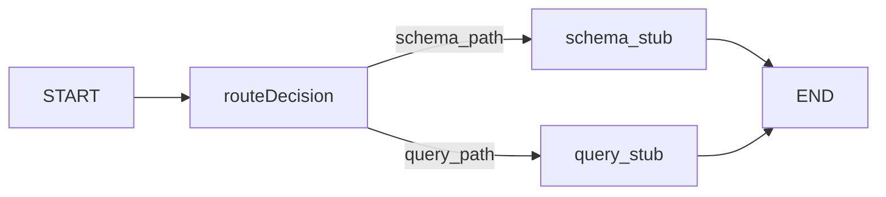
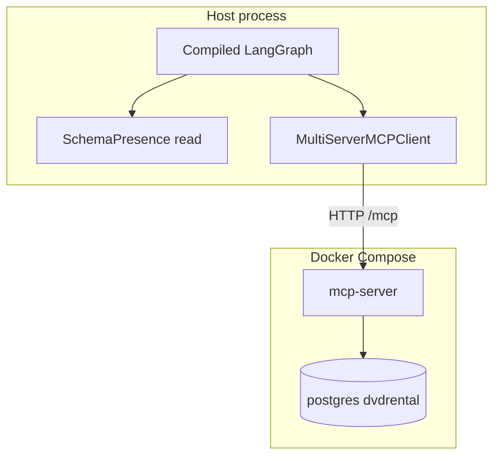

# Spec 04 — Schema-presence gate (conditional routing)

**Sources of truth:** [TASK.md](../TASK.md), [AGENTS.md](../AGENTS.md). Build on [specs/01-bootstrap.md](01-bootstrap.md), [specs/02-tools-mcp.md](02-tools-mcp.md), and [specs/03-graph-shell.md](03-graph-shell.md). This spec **extends** the LangGraph shell with **minimal branching** so the **query** path always has **schema documentation in memory** when needed; it does not replace prior specs.

**Forward compatibility:** Persistence of approved schema descriptions and full **Schema Agent + HITL** belong in a follow-on spec (e.g. **[specs/05-schema-agent-hitl.md](05-schema-agent-hitl.md)**). **Persistent vs session memory** belong in **[specs/07-memory.md](07-memory.md)**. Until those specs exist, this document defines a **narrow seam** (§8) so the gate stays testable and swappable.

---

## 1. Purpose

The product flow is **always oriented toward answering the user’s natural-language questions with safe SQL** ([TASK.md](../TASK.md) querying flow). The user is **not** choosing between “run schema analysis” and “run a query” per message, and the graph must **not** branch on NL intent.

The **schema-presence gate** answers only one question: **does persisted schema documentation already exist** so the **query** side can use it as **context** when generating SQL? If **no**, the graph runs the **schema-ingestion side first** (here: **`schema_stub`** until the Schema Agent + memory specs exist): that path **materializes** table/column descriptions per [TASK.md](../TASK.md) and **stores** them in **persistent memory** (specified later). If **yes**, the graph goes straight to the **query** path. Both branches exist **so that query execution has the documentation it needs**—not to offer an alternate “schema analysis mode” driven by user wording.

**Functional outcome:**

- **Not ready** → **`schema_stub`** (prerequisite for well-grounded queries; future: full Schema Agent → HITL → persist into memory).
- **Ready** → **`query_stub`** (same as Spec 03 for now; future: Query Agent consumes persisted docs as context).
- **No LLM** in Spec 04; **no NL intent classification**. Routing uses **only** the **`SchemaPresence`** check (deterministic: file / marker contract, §8)—**never** `user_input` phrasing to pick a branch.
- **≥1** branch still hits MCP: **`query_stub`** uses **`execute_readonly_sql`**; **`schema_stub`** should call **`inspect_schema`** at least once (recommended) until the Schema Agent replaces that stub.
- Logs and **`steps`** record the **gate decision** and branch for observability.

---

## 2. Scope

| In scope | Out of scope (defer to later specs / not this PR) |
| --- | --- |
| **`add_conditional_edges`** (or equivalent) from **`START`** or from a tiny **`gate`** node | Full **Schema Agent** (metadata → NL drafts → persist) |
| **`schema_stub`** node: stand-in for **“ensure schema docs exist for the query agent”**; no LLM; optional **`inspect_schema`** via `MultiServerMCPClient` | **HITL** interrupts, approval UI, editing descriptions ([TASK.md](../TASK.md) schema flow steps 3–5) — planned **schema agent + HITL** spec |
| **`query_stub`**: retain Spec 03 behavior (fixed safe `execute_readonly_sql`) — this is always the **query-execution** track once docs are ready | **Query Agent** NL→SQL, critic/validator loop |
| **`SchemaPresence`** (or equivalent) **read-only** check: file or injectable backend | Full **persistent memory** design (preferences, session fields) — planned **memory** spec |
| State fields: `schema_ready`, `gate_decision`, append to `steps` | LiteLLM / chat models |
| Unit tests with **injected** presence backend (both branches) | Streamlit, HTTP API |
| Structured logging: gate decision, branch | Full observability rubric as a dedicated pass |

**Seams:** Spec 04 **reads** readiness only. A follow-on spec will implement the **Schema Agent** that produces approved descriptions per [TASK.md](../TASK.md) and **writes** them into **persistent memory**; the query agent will **read** that same store as **context** for NL→SQL. The marker file (§8) is a temporary stand-in until the memory spec lands. The gate does **not** interpret whether the user “wants” documentation—it only checks whether documentation **already exists** for the query path.

---

## 3. Target repository layout

Extend the existing **`src/graph/`** package from [specs/03-graph-shell.md](03-graph-shell.md):

```text
src/
  graph/
    __init__.py
    state.py              # GraphState: add gate-related fields (§7)
    graph.py              # build_graph(): conditional edges (§6, §9)
    nodes.py              # query_stub (existing), schema_stub (new)
    presence.py           # SchemaPresence protocol + default file implementation (§8)
  config/
    ...                   # optional: new setting for presence file path (§5)
```

**Rules:**

- **No** `psycopg` in `presence.py` or gate logic—DB access stays on the MCP server ([specs/02-tools-mcp.md](02-tools-mcp.md)).
- **`presence.py`** is **synchronous** I/O (read small JSON) unless you later add async; routing functions may call sync code from async graph nodes if kept trivial (or use a sync gate node pattern—see §6).

**Packaging:** No new top-level packages; only new modules under `src/graph/` (and optional `config` fields). **`pyproject.toml`** Hatch packages unchanged from Spec 03 unless a new package is added elsewhere (not required for Spec 04).

---

## 4. Dependencies

- **Python:** `>=3.12` ([pyproject.toml](../pyproject.toml)).
- **Runtime:** **`langgraph`** (already required by Spec 03). No new dependency **unless** you introduce a library for paths or schemas—prefer **stdlib** (`json`, `pathlib`) for the default marker file ([AGENTS.md](../AGENTS.md): use **`uv add`** only when adding a real dependency).
- **Existing:** `langchain-mcp-adapters` / `MultiServerMCPClient` for nodes.

**Acceptance:** Spec 04 remains **LLM-free**.

---

## 5. Configuration

Reuse **[MCPSettings](../src/config/mcp_settings.py)** (or the graph’s existing settings object) for **`MCP_SERVER_URL`** / streamable HTTP URL construction, consistent with [specs/03-graph-shell.md](03-graph-shell.md) §5.

Add **optional** settings for the default presence store (implementation may use env-only if you prefer not to extend Pydantic models in this PR—document the choice):

| Variable | Purpose | Notes |
| --- | --- | --- |
| `SCHEMA_PRESENCE_PATH` | Filesystem path to the **readiness marker** JSON file. | Default: e.g. `data/schema_presence.json` relative to repo root, or under `user_data_dir`—pick one convention and document in `.env.example`. |
| `MCP_SERVER_URL` | Graph MCP client (unchanged). | Required for `schema_stub` / `query_stub` MCP calls. |
| `GRAPH_DEBUG` | Verbose graph logs (optional, inherited). | If set, may log gate inputs (path resolved, not file contents). |

**Secrets:** Do not store DB passwords in the presence file; it is a **marker** for “schema docs were persisted,” not credentials.

---

## 6. LangGraph API contract (normative)

**Pattern:** Use **`add_conditional_edges`** so a **routing function** returns a **string key** mapped to the next node name (LangGraph standard pattern).

**Normative style for this repo:** **`START` → conditional routing** (no separate `gate` node) keeps the graph small. Alternative: add a **`gate`** node that writes `schema_ready` / `gate_decision` into state, then **`add_conditional_edges("gate", ...)`**—allowed if tests and docs stay consistent.

### 6.1 Routing function (sync)

The router inspects **current state** and/or a **SchemaPresence** instance resolved at compile time or passed via closure:

```python
from langgraph.graph import END, START, StateGraph

from graph.presence import FileSchemaPresence
from graph.state import GraphState


def route_after_start(state: GraphState) -> str:
    presence = FileSchemaPresence.from_settings()  # or inject for tests
    ready = presence.is_ready()
    return "query_path" if ready else "schema_path"
```

Map keys to node names:

```python
workflow = StateGraph(GraphState)
workflow.add_node("schema_stub", schema_stub)
workflow.add_node("query_stub", query_stub)

workflow.add_conditional_edges(
    START,
    route_after_start,
    {
        "schema_path": "schema_stub",
        "query_path": "query_stub",
    },
)
workflow.add_edge("schema_stub", END)
workflow.add_edge("query_stub", END)

app = workflow.compile()
```

**Invocation:** unchanged from Spec 03: **`await app.ainvoke({...})`** with documented minimum keys (§7).

**Routing rule:** **`route_after_start`** (or equivalent) must **not** use **`state["user_input"]`** (or any NL) to choose **`schema_path`** vs **`query_path`**. Only **`SchemaPresence.is_ready()`** (and optionally fixed config) may decide. **`user_input`** remains in state for **downstream query nodes** once those exist.

### 6.2 Async nodes

If **`schema_stub`** and **`query_stub`** remain **`async def`**, the graph uses **`ainvoke`**. The **routing function** is typically **sync**; keep presence checks **fast** and non-blocking.

---

## 7. State schema (deltas on Spec 03)

Extend **`GraphState`** ([specs/03-graph-shell.md](03-graph-shell.md) §7) with **`total=False`** fields:

| Field | Purpose | Type |
| --- | --- | --- |
| `user_input` | User’s NL question (carried for future **Query Agent**); **gate must not use it for routing** (§6). | `str` |
| `steps` | Append-only record: include **`gate`** or routing id, **`schema_stub`** / **`query_stub`**. | `list[str]` |
| `schema_ready` | Result of the last presence check (**optional** if only routing logs). | `bool \| None` |
| `gate_decision` | Machine-readable branch: e.g. **`"schema_path"`** \| **`"query_path"`**. | `str \| None` |
| `last_result` | Tool output summary (either branch). | `str \| dict \| None` |
| `last_error` | User-safe error string. | `str \| None` |

**Future:** Conversation **`messages`**, reducers, and rich memory attach in later specs—do not require them for Spec 04.

**Minimal `TypedDict` excerpt (illustrative):**

```python
class GraphState(TypedDict, total=False):
    user_input: str
    steps: list[str]
    schema_ready: bool | None
    gate_decision: str | None
    last_result: str | dict | None
    last_error: str | None
```

---

## 8. Schema presence seam (read-only)

**Goal:** The gate must be **unit-testable** without Docker by **injecting** a fake backend.

### 8.1 Protocol / interface

Define a small **protocol** (e.g. `typing.Protocol`) or abstract base class:

```python
from typing import Protocol


class SchemaPresence(Protocol):
    def is_ready(self) -> bool:
        """True if persisted schema documentation exists for the query agent to use as context."""

    def reason(self) -> str | None:
        """Optional short debug string (e.g. 'missing file', 'invalid json')."""
```

**Rules:**

- **`is_ready()`** must be safe to call on every invocation (read-only, no network unless you explicitly document otherwise—default is **local file only**).
- **Spec 05 (schema agent + HITL)** will **create/update** the documentation this interface reflects (and persist via memory per **[specs/07-memory.md](07-memory.md)**); Spec 04 only defines **shape** and **location** contract for the readiness check.

### 8.2 Default: JSON marker file

Suggested minimal **on-disk** contract (exact keys can be versioned):

```json
{
  "version": 1,
  "ready": true,
  "updated_at": "2026-01-01T00:00:00Z"
}
```

**`is_ready()`** returns **`True`** iff the file exists, parses as JSON, and **`ready`** is **`true`** (and **`version`** is supported if you add migration later).

Place the file under **`data/schema_presence.json`** (or path from **`SCHEMA_PRESENCE_PATH`**). Add **`data/.gitkeep`** if the directory is empty in git; **gitignore** actual marker files if they contain local-only state—prefer committing **example** only in `.env.example` / docs, not real data.

---

## 9. MCP wiring from graph (no duplicate tool logic)

- **`query_stub`:** Unchanged: **`execute_readonly_sql`** with **fixed** safe SQL ([specs/03-graph-shell.md](03-graph-shell.md) §8). Represents the **query-execution** track; in the full system it runs **after** schema docs are available and uses them as **context** (from memory), not raw NL routing.
- **`schema_stub`:** **Recommended:** call **`inspect_schema`** once via **`MultiServerMCPClient`** (same client pattern as Spec 03). **Do not** reimplement SQL introspection in Python. This branch is the **prerequisite** “ensure documentation exists” track, not a separate user-facing mode.
- **Read-only:** All execution remains subject to [AGENTS.md](../AGENTS.md) forbidden tokens; **`inspect_schema`** is read-only by design.

---

## 10. Nodes and edges



Here **`routeDecision`** denotes the **conditional edge** from **`START`** (not necessarily a named node).

### Node: routing side effects (recommended)

Whether or not you use a dedicated **`gate`** node, ensure **`steps`** and **`gate_decision`** are updated so tests can assert behavior without relying only on logs.

### Node: `schema_stub` (required)

- Append **`schema_stub`** to **`steps`**.
- Set **`gate_decision`** to **`"schema_path"`** (if not already set by a gate node).
- Call **`inspect_schema`** (recommended) and store a short summary in **`last_result`**.
- **Do not** persist descriptions in Spec 04 (no HITL). In the full architecture, this node’s successor specs **produce** the documentation the **query agent** will later **read from memory** as context—not because the user asked for “schema mode.”

### Node: `query_stub` (required)

- Same as Spec 03: append **`query_stub`**, set **`gate_decision`** to **`"query_path"`**, run fixed safe SQL via **`execute_readonly_sql`**.
- In the full architecture, this path is where the **Query Agent** runs **using persisted schema documentation** from memory alongside **`user_input`**.

---

## 11. Logging

- **On routing:** Log **`gate_decision`**, **`schema_ready`** (boolean), and optional **`presence.reason()`** at **INFO**.
- **Per node:** Keep Spec 03 enter/exit pattern ([specs/03-graph-shell.md](03-graph-shell.md) §10).
- **Grep-friendly** keys: e.g. `graph_node`, `graph_phase`, `gate_decision`, `schema_ready`.

---

## 12. Acceptance criteria

1. **Graph compiles** with **`add_conditional_edges`** and two terminal branches to **`END`**.
2. **`ainvoke`** completes for **both** branches when **`SchemaPresence`** is stubbed/mocked:
   - **Not ready** → **`schema_stub`** runs (assert **`steps`** / **`gate_decision`**).
   - **Ready** → **`query_stub`** runs.
3. **MCP:** With services up, **`schema_stub`** performs **`inspect_schema`** and **`query_stub`** performs **`execute_readonly_sql`** (integration optional if CI lacks Docker).
4. **Logs** include a clear **gate** line (decision + ready flag).
5. **Lint:** `uv run ruff check .` and `uv run ruff format .` pass.
6. **Commits:** Conventional Commits ([AGENTS.md](../AGENTS.md)).

---

## 13. Verification commands

```bash
docker compose up -d
docker ps --filter name=multiagent-postgres
docker ps --filter name=multiagent-mcp-server

uv sync
cp -n .env.example .env

uv run pytest tests/ -q
uv run pytest -m integration -q

uv run ruff check .
uv run ruff format .
```

---

## 14. Implementation checklist

1. Add **`graph/presence.py`**: **`SchemaPresence`** protocol + **`FileSchemaPresence`** (or equivalent) reading **`SCHEMA_PRESENCE_PATH`**.
2. Extend **`graph/state.py`**: **`schema_ready`**, **`gate_decision`** (and ensure **`steps`** semantics).
3. Implement **`schema_stub`** in **`graph/nodes.py`** (async): MCP **`inspect_schema`**, logging, state updates.
4. Refactor **`graph/graph.py`**: **`add_conditional_edges`** from **`START`**, wire **`schema_stub`** / **`query_stub`**.
5. Optional: extend **`config`** with **`SCHEMA_PRESENCE_PATH`** and document in **`.env.example`**.
6. **Tests:** compile smoke; branch tests with **injected** presence (monkeypatch or dependency injection); optional integration with Compose.
7. **Ruff + pytest**; **Conventional Commits** (e.g. `feat(graph): add schema-presence gate`).

---

## 15. Prompt for coding agent (optional)

Implement **`specs/04-schema-gate.md`**:

1. Introduce **`SchemaPresence`** + default file reader; support test injection.
2. Extend **`GraphState`** with gate fields; append **`steps`** consistently.
3. Add **`schema_stub`** (**`inspect_schema`**); keep **`query_stub`** from Spec 03.
4. Replace linear **`START → query_stub → END`** with **`add_conditional_edges`** from **`START`**.
5. Log gate decisions; add unit tests for both branches.
6. Run **ruff** + **pytest**; use **`uv add`** only if a new dependency is truly needed.

---

## 16. Reference diagram (high level)



---

## 17. Key differences from Spec 03

| Aspect | Spec 03 | Spec 04 |
| --- | --- | --- |
| **Graph shape** | Linear: **`START → query_stub → END`** | **Branching:** **`START`** → **`schema_stub`** **or** **`query_stub`** → **`END`** |
| **Routing** | None | **Schema-presence gate** (deterministic) |
| **New nodes** | **`query_stub` only** | **`schema_stub`** + conditional routing |
| **Persistence** | None | **Read-only** check via **`SchemaPresence`** (default file) |
| **MCP tools used** | **`execute_readonly_sql`** (and optionally **`inspect_schema`**) | Both branches: **`inspect_schema`** (recommended) on schema path, **`execute_readonly_sql`** on query path |

---

## 18. Relationship to assignment themes

[TASK.md](../TASK.md) requires **explicit nodes/edges and routing**. This spec satisfies **routing** as **infrastructure for query quality**, not as **user-intent classification**.

- **End goal:** The user **always** gets support for **natural-language querying** (with safe execution). The **Schema Agent** exists so the **Query Agent** has **high-quality persisted descriptions** (and metadata) as **context** when generating SQL—not as an optional “branch” the user selects with their wording.
- **Gate logic:** **Only** “are schema docs already in persistent memory (or marker)?” **Never** “does this message sound like schema work vs a question?”
- **Later specs:** Schema agent + HITL **writes** memory; query agent + critic **reads** it. This spec’s conditional edge is the **readiness check** between those concerns.
