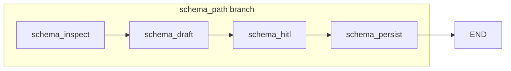

# Spec 05 — Schema agent + human-in-the-loop (one-shot persist)

**Sources of truth:** [TASK.md](../TASK.md), [AGENTS.md](../AGENTS.md). Build on [specs/01-bootstrap.md](01-bootstrap.md), [specs/02-tools-mcp.md](02-tools-mcp.md), [specs/03-graph-shell.md](03-graph-shell.md), and [specs/04-schema-gate.md](04-schema-gate.md). This spec **implements the write side** of schema documentation that Spec 04’s gate only **reads**; it does not replace prior specs.

**Forward compatibility:** Full **Query Agent** (NL→SQL, critic, refinement) belongs in a follow-on spec. **Persistent vs session memory** for user preferences and thread context belongs in a follow-on memory spec. Until then, Spec 05 defines a **minimal on-disk contract** for approved schema descriptions plus the existing **readiness marker** so [`graph/presence.py`](../src/graph/presence.py) and tests stay coherent.

---

## 1. Purpose

Deliver the **Schema Agent** slice of [TASK.md](../TASK.md): **once** (or on explicit user/system request), **inspect** PostgreSQL metadata via MCP, **draft** natural-language descriptions for tables and columns, pause for **human-in-the-loop (HITL)** approval or edits, then **persist** approved descriptions so the **query** path can reuse them—without re-running inspection on every user message.

**Functional outcome:**

- **End-to-end schema branch:** `inspect_schema` (MCP) → structured **draft** in graph state → **`interrupt()`** surfaces draft to caller → resume with **approved/edited** payload → **atomic persist** (documentation file + readiness marker per §9).
- **Gate integration:** After a successful run, [`SchemaPresence`](../src/graph/presence.py) reports **ready** per [specs/04-schema-gate.md](04-schema-gate.md) §8 so the next invocation can take **`query_path`** without NL-based routing.
- **Proof of reuse:** Document how a follow-on query implementation **loads** the same persisted JSON as context (smoke: read file in test or stub query node).
- **Safety:** No persistence of descriptions without **explicit** human resume payload representing approval (aligned with [AGENTS.md](../AGENTS.md)). All **SQL execution** on the DVD Rental database remains **read-only** via existing MCP tools ([specs/02-tools-mcp.md](02-tools-mcp.md)).

---

## 2. Scope

| In scope | Out of scope (later / not this PR) |
| --- | --- |
| Replace or extend **`schema_stub`** with a **linear schema pipeline** (see §10): inspect → draft → HITL → persist | Full **Query Agent**, critic/validator loop, NL→SQL |
| **LangGraph** `interrupt()` / `Command(resume=…)` with **checkpointer** + `thread_id` (§6) | General **intent router** or routing on **`user_input`** ([specs/04-schema-gate.md](04-schema-gate.md) forbids this) |
| **LLM-assisted drafting** (table/column descriptions) when a model is configured | LiteLLM proxy **setup** as its own deliverable unless already in repo |
| **Persistence** of approved docs + marker update (§9) | Full **preferences** store, session memory design |
| State fields for draft / approval / persist errors; logging for HITL and persist | Streamlit / HTTP API (optional follow-on UI spec) |
| **Unit tests:** interrupt pause + resume + marker ready; optional `@pytest.mark.integration` with Docker + MCP | Rewriting Specs 01–04 |

---

## 3. Target repository layout

Introduce an **`agents`** package for Schema Agent **prompts and LLM callables** (keeps graph orchestration separate from prompt text). Keep **graph wiring** under **`src/graph/`**.

```text
src/
  agents/
    __init__.py
    schema_agent.py       # build_schema_draft(metadata) -> structured draft; no graph imports
  graph/
    __init__.py
    state.py              # extend GraphState (§7)
    graph.py              # compile with checkpointer when schema path includes HITL
    nodes.py              # query_stub, and/or imports from schema_pipeline
    schema_pipeline.py    # NEW: schema_inspect, schema_draft, schema_hitl, schema_persist nodes
    presence.py           # unchanged read side (Spec 04)
  config/
    ...                   # optional: SCHEMA_DOCS_PATH, model-related settings
  mcp_server/
    ...                   # unchanged; tools stay on server per Spec 02
```

**Packaging:** Add **`src/agents`** to `[tool.hatch.build.targets.wheel] packages` in [pyproject.toml](../pyproject.toml) and extend **ruff** `known-first-party` with `agents` when the package is added ([AGENTS.md](../AGENTS.md): use project conventions).

**Async:** Nodes that call MCP should remain **`async`** and use **`MultiServerMCPClient`** as in [specs/03-graph-shell.md](03-graph-shell.md) §8. **`interrupt()`** may be called from sync or async nodes per LangGraph; keep **one** style per node for clarity.

---

## 4. Dependencies

- **Python:** `>=3.12` ([pyproject.toml](../pyproject.toml)).
- **Runtime:** **`langgraph>=1.1.7`** (already declared). HITL requires **`compile(checkpointer=…)`** (§6).
- **Checkpointer (tests / dev):** Use **`langgraph.checkpoint.memory.MemorySaver`** — in this repo’s lockfile, **`MemorySaver`** is an alias for **`InMemorySaver`** (either name resolves to the same class). Prefer **`MemorySaver`** in new code for consistency with LangGraph docs examples.
- **Chat model:** Add via **`uv add`** (e.g. provider SDK + **`langchain-openai`** or course-approved equivalent). **Do not** hand-edit dependency arrays in `pyproject.toml` ([AGENTS.md](../AGENTS.md)).
- **Existing:** `langchain-mcp-adapters`, MCP server per [specs/02-tools-mcp.md](02-tools-mcp.md).

---

## 5. Configuration

Reuse **MCP** and **Postgres** settings from prior specs; add **schema documentation** paths and **model** env vars (exact names are implementation details—document in **`.env.example`** when implemented):

| Variable | Purpose | Notes |
| --- | --- | --- |
| `SCHEMA_DOCS_PATH` | Filesystem path to the **approved schema documentation JSON** (payload, §9.2). | Default e.g. `<repo>/data/schema_docs.json`. **Distinct** from the marker file. |
| `SCHEMA_PRESENCE_PATH` | Readiness **marker** path ([specs/04-schema-gate.md](04-schema-gate.md) §5, §8). | Spec 05 **writes** this file only after a successful persist (§9.3). |
| `MCP_SERVER_URL` | MCP client for **`inspect_schema`**. | Unchanged from Specs 02–04. |
| Model / API keys | LLM for drafting only. | No secrets in git; use env vars only. |

**Optional:** `GRAPH_DEBUG`, `OPENAI_API_KEY` (or provider-specific), `SCHEMA_AGENT_MODEL` — document when added.

---

## 6. LangGraph API contract (normative)

### 6.1 Pipeline shape

**Normative for this repo:** Replace **`schema_stub`** with a **linear sequence** of named nodes (either inline in [`graph/graph.py`](../src/graph/graph.py) or delegated to [`schema_pipeline.py`](../src/graph/schema_pipeline.py) per §3):

1. **`schema_inspect`** — Call MCP **`inspect_schema`**; store normalized metadata summary / full payload reference in state (`schema_metadata` or equivalent).
2. **`schema_draft`** — Call `agents.schema_agent` to produce **`schema_draft`** (structured NL descriptions). If no model is configured, the spec allows a **deterministic stub** draft for tests (tables/columns with placeholder text) so HITL + persist still run.
3. **`schema_hitl`** — Call **`interrupt()`** with a **JSON-serializable** payload (draft + optional hints). On resume, merge human-approved structure into **`schema_approved`** (see §7).
4. **`schema_persist`** — Write **payload file** then **marker file** per §9; append **`schema_persist`** to **`steps`**; set **`last_result`** / errors.

Edges: **`schema_inspect` → `schema_draft` → `schema_hitl` → `schema_persist` → `END`** (all on the **schema_path** branch from Spec 04).

### 6.2 Checkpointer and `thread_id`

Dynamic **`interrupt()`** requires:

1. **`app = workflow.compile(checkpointer=checkpointer)`** — no checkpointer → interrupts are not durable / not supported for HITL.
2. **`config = {"configurable": {"thread_id": "<stable-id>"}}`** on every **`invoke` / `ainvoke` / resume** for that run.

Use a **durable** checkpointer (e.g. SQLite) for production demos if the process must survive restarts; **`MemorySaver`** is sufficient for CI unit tests.

### 6.3 Dynamic HITL (**mandated pattern**)

Use **`from langgraph.types import interrupt, Command`**:

- Inside **`schema_hitl`**, call **`human = interrupt({...})`** where the dict includes enough for a UI or test to render the draft (e.g. `kind`, `draft`, optional `summary`).
- The **caller** resumes with **`graph.invoke(Command(resume=<payload>), config=config)`** (or **`ainvoke`**). The value **`Command(resume=…)`** becomes the **return value** of **`interrupt()`** inside the node on the next step.

**Official guidance:** `Command(resume=…)` is the intended **input** pattern to **`invoke` / `stream`** to continue after a pause (as opposed to other `Command` fields used when **returning** from nodes).

### 6.4 Critical runtime rule (idempotency)

**On resume, the node that contains `interrupt()` runs again from the beginning**—any code **before** `interrupt()` executes again. Therefore:

- Do **not** perform non-idempotent work before `interrupt()` unless guarded by state (e.g. skip MCP re-fetch if `state.get("schema_metadata")` is already populated).
- Prefer: metadata and draft already in state **before** entering `schema_hitl`, and `schema_hitl` only packages the interrupt + assigns **`schema_approved`** from the resume value—or use a **thin** `schema_hitl` that only calls `interrupt()` and merges output.

### 6.5 Invoke API version (`v2`)

For **LangGraph ≥ 1.1**, tests and demos should document **one** pattern:

- Prefer **`graph.invoke(..., config=config, version="v2")`** so the paused run returns a **`GraphOutput`** with an **`interrupts`** field for assertions.
- Alternatively document legacy dict **`__interrupt__`** keys for `version` omitted—pick **one** style in implementation and tests to avoid drift.

### 6.6 Static breakpoints (**non-normative alternative**)

Teams may use **`compile(..., interrupt_before=["schema_persist"], checkpointer=…)`** to pause **between** supersteps without `interrupt()` in code. This spec **mandates dynamic `interrupt()`** in **`schema_hitl`** so the resume payload can carry **structured edits** to descriptions in one step.

### 6.7 Parallel interrupts

If multiple **`interrupt()`** calls could fire in one superstep, LangGraph supports resuming with a **map** of interrupt id → value. **Normative:** use **a single** `interrupt()` for the schema pipeline so **`Command(resume=…)`** stays a plain object.

### 6.8 Streaming (optional note)

For a future UI, combine **`stream_mode`** (e.g. `"messages"`, `"updates"`) and detect interrupt chunks, then resume with **`Command(resume=…)`** per LangGraph streaming docs—out of scope for minimal pytest proof.

---

## 7. State schema (deltas on Spec 04)

Extend **`GraphState`** ([specs/04-schema-gate.md](04-schema-gate.md) §7) with **`total=False`** fields:

| Field | Purpose | Type |
| --- | --- | --- |
| `schema_metadata` | Normalized output / handle from **`inspect_schema`** for drafting and audit. | `dict \| None` |
| `schema_draft` | LLM (or stub) output: proposed table/column descriptions. | `dict \| None` |
| `schema_approved` | Post-HITL structure committed to disk in **`schema_persist`**. | `dict \| None` |
| `hitl_prompt` | Optional echo of what was shown at interrupt (debug / UX). | `dict \| None` |
| `persist_error` | User-safe message if persist fails. | `str \| None` |

**Minimal `TypedDict` excerpt (illustrative):**

```python
class GraphState(TypedDict, total=False):
    user_input: str
    steps: list[str]
    schema_ready: bool | None
    gate_decision: str | None
    last_result: str | dict | None
    last_error: str | None
    # Spec 05
    schema_metadata: dict | None
    schema_draft: dict | None
    schema_approved: dict | None
    hitl_prompt: dict | None
    persist_error: str | None
```

Append to **`steps`** for **`schema_inspect`**, **`schema_draft`**, **`schema_hitl`**, **`schema_persist`** consistently ([specs/03-graph-shell.md](03-graph-shell.md)).

---

## 8. Persistence contract

### 8.1 Two files

| Artifact | Role | Consumer |
| --- | --- | --- |
| **Documentation payload** (`SCHEMA_DOCS_PATH`) | Rich JSON: approved descriptions + optional metadata digest | Future **Query Agent** loads as grounding context |
| **Readiness marker** (`SCHEMA_PRESENCE_PATH`) | Small JSON: `version`, `ready`, `updated_at` per §8.3 (ordered atomic writes) | **`FileSchemaPresence.check()`** |

### 8.2 Payload JSON (normative minimum)

Top-level keys (version for future migrations):

```json
{
  "version": 1,
  "updated_at": "2026-04-17T12:00:00Z",
  "source": "schema_agent_hitl",
  "tables": [
    {
      "schema": "public",
      "name": "actor",
      "description": "Approved table description.",
      "columns": [
        {
          "name": "actor_id",
          "description": "Approved column description."
        }
      ]
    }
  ]
}
```

**Optional:** `metadata_fingerprint` (hash of `schema_metadata`) to detect stale docs after DB migrations—optional but recommended for implementers to handle schema drift detection.

### 8.3 Atomic readiness (**ordering**)

To avoid “marker ready but payload missing or partial”:

1. Write the **payload** file to a **temp path** in the same directory, **`fsync` optional**, then **`os.replace`** into `SCHEMA_DOCS_PATH`.
2. Only if step 1 succeeds, write the **marker** JSON to a **temp path** and **`os.replace`** into `SCHEMA_PRESENCE_PATH` with **`ready: true`**.
3. If step 2 fails after step 1 succeeded, log **`persist_error`** and set **`ready: false`** in the marker (or do not write marker at all). **Normative minimum:** never write **`ready: true`** to the marker file unless the payload file has been successfully persisted to `SCHEMA_DOCS_PATH` and exists on disk.

### 8.4 Query path contract

A follow-on query spec will require: **before NL→SQL**, load **`SCHEMA_DOCS_PATH`** if `SchemaPresence.check().ready` is **True** and inject summaries into prompts or state. Spec 05 only **defines** the file shape and location.

---

## 9. MCP wiring

- **`schema_inspect`** (and only where needed): **`inspect_schema`** via **`MultiServerMCPClient`** — same pattern as [specs/03-graph-shell.md](03-graph-shell.md) §8 / **`schema_stub`** today. **No** duplicate `information_schema` queries in graph code.
- **Persist step:** **No** new MCP tool is required for writing JSON to the agent host filesystem; if a future MCP tool persists to a remote store, it must still respect [AGENTS.md](../AGENTS.md) (no destructive SQL).
- **Read-only SQL:** The schema pipeline does **not** need **`execute_readonly_sql`** for the minimal slice; optional sanity **`SELECT 1`** checks are allowed with fixed SQL + `LIMIT`.

---

## 10. Nodes and edges (schema branch)



**Integration with Spec 04:** The conditional edge from **`START`** remains unchanged in **intent**: only **`SchemaPresence`** decides **`schema_path`** vs **`query_path`**. **`schema_path`** replaces **`schema_stub`** with the linear **`schema_inspect` → `schema_draft` → `schema_hitl` → `schema_persist`** pipeline (document final node names in code comments).

**`user_input`:** Still **must not** influence gate routing ([specs/04-schema-gate.md](04-schema-gate.md) §6). It may be passed through state for logging or future query use.

---

## 11. Logging

- **Per node:** Enter/exit logs consistent with Specs 03–04 (`graph_node`, `graph_phase`).
- **HITL:** Log **`hitl_interrupt`** / **`hitl_resume`** with **no** secrets; log payload **sizes** or table **counts**, not full API keys or raw LLM prompts if they contain credentials.
- **Persist:** Log success/failure paths (`schema_docs_path`, `schema_presence_path` as strings), not file contents.

---

## 12. Acceptance criteria

1. **Graph compiles** with a **checkpointer** whenever the schema pipeline includes **`interrupt()`**.
2. **Unit test** (no Docker): **`MemorySaver`**, fixed **`thread_id`**, run schema subgraph or full graph on **`schema_path`** with stubbed MCP + stub draft → first **`invoke`** stops at interrupt → second **`invoke(Command(resume=…))`** completes **`schema_persist`**.
3. **After success:** **`FileSchemaPresence.check().ready`** is **True** and **`SCHEMA_DOCS_PATH`** parses as JSON with **`version`: 1** and non-empty **`tables`** (or documented empty-DB edge case).
4. **Idempotency:** Documented test or assertion that **`schema_hitl`** does not duplicate **`inspect_schema`** calls across resume when metadata is already present (per §6.4).
5. **MCP integration (optional):** With Compose up, **`schema_inspect`** returns real **`dvdrental`** metadata (`@pytest.mark.integration`).
6. **Lint:** `uv run ruff check .` and `uv run ruff format .` pass.
7. **Commits:** Conventional Commits ([AGENTS.md](../AGENTS.md)).

---

## 13. Verification commands

```bash
docker compose up -d
docker ps --filter name=multiagent-postgres
docker ps --filter name=multiagent-mcp-server

uv sync
cp -n .env.example .env

uv run pytest tests/ -q
uv run pytest -m integration -q

uv run ruff check .
uv run ruff format .
```

---

## 14. Normative code snippets (embed in implementation docs / mirror in tests)

These snippets are **contract hints** for implementers (same patterns should appear in tests).

### 14.1 Checkpointer, compile, `thread_id`

```python
from langgraph.checkpoint.memory import MemorySaver
from langgraph.graph import END, START, StateGraph

checkpointer = MemorySaver()
app = workflow.compile(checkpointer=checkpointer)

config = {"configurable": {"thread_id": "schema-ingest-001"}}
```

### 14.2 Dynamic HITL node (resume + idempotency comment)

```python
from langgraph.types import Command, interrupt

def schema_hitl(state: GraphState) -> dict:
    # On resume, this node runs from the top again—metadata and draft are already
    # set in state by prior nodes (schema_inspect, schema_draft), so we can safely
    # reference them here without re-fetching or re-generating.
    payload = {
        "kind": "schema_review",
        "draft": state.get("schema_draft"),
    }
    approved = interrupt(payload)
    return {"schema_approved": approved, "steps": state["steps"] + ["schema_hitl"]}
```

### 14.3 Pause and resume (`v2` invoke)

```python
from langgraph.types import Command

config = {"configurable": {"thread_id": "schema-ingest-001"}}
out = app.invoke({"user_input": ""}, config=config, version="v2")
# assert out.interrupts non-empty on first run
app.invoke(Command(resume={"approved": True, "tables": []}), config=config, version="v2")
```

### 14.4 Atomic file write helper (signature sketch)

```python
from pathlib import Path
import json
import os
import tempfile


def write_json_atomic(path: Path, obj: object) -> None:
    path.parent.mkdir(parents=True, exist_ok=True)
    data = json.dumps(obj, indent=2, ensure_ascii=False).encode("utf-8")
    fd, tmp = tempfile.mkstemp(prefix=".tmp-", dir=path.parent)
    try:
        os.write(fd, data)
        os.close(fd)
        os.replace(tmp, path)
    except BaseException:
        os.close(fd)
        try:
            os.unlink(tmp)
        except OSError:
            pass
        raise
```

---

## 15. Implementation checklist

1. Add **`src/agents/`** package + **`schema_agent.py`**; register package in [pyproject.toml](../pyproject.toml).
2. Add **`src/graph/schema_pipeline.py`** (or equivalent) with **`schema_inspect`**, **`schema_draft`**, **`schema_hitl`**, **`schema_persist`**.
3. Extend **`GraphState`** in **`graph/state.py`** (§7).
4. Refactor **`graph/graph.py`**: on **`schema_path`**, wire the new nodes; **`compile(checkpointer=…)`** when HITL enabled (may always compile with checkpointer for simplicity).
5. Implement **atomic persist** + marker update (§9); reuse **`SCHEMA_PRESENCE_PATH`** semantics from Spec 04.
6. **Tests:** unit HITL loop with **`MemorySaver`** and stubbed MCP; optional integration.
7. **`.env.example`**: document **`SCHEMA_DOCS_PATH`**, model vars.
8. **Ruff + pytest**; Conventional Commits (e.g. `feat(schema): add HITL persist pipeline`).

---

## 16. Prompt for coding agent (optional)

Implement **`specs/05-schema-agent-hitl.md`**:

1. Add **`agents/schema_agent.py`** and **`graph/schema_pipeline.py`** per §3; extend **`GraphState`**.
2. Replace **`schema_stub`** with **`schema_inspect` → … → `schema_persist`** on **`schema_path`**.
3. **`compile(checkpointer=MemorySaver())`** (or durable saver for demos); **`thread_id`** on all invocations.
4. Implement **`schema_hitl`** with **`interrupt()`** and **`Command(resume=…)`**; guard pre-interrupt side effects (§6.4).
5. Persist **payload** then **marker** (§9.3); verify **`FileSchemaPresence`** flips to ready.
6. **pytest** for interrupt/resume + presence; **ruff** clean; **`uv add`** for any new runtime deps.

---

## 17. Key differences from Spec 04

| Aspect | Spec 04 | Spec 05 |
| --- | --- | --- |
| **`schema_path` node** | **`schema_stub`** (inspect only, no persist) | **Pipeline** inspect → draft → HITL → persist |
| **Persistence** | Read-only **marker** check | **Writes** docs JSON + **marker** |
| **HITL** | None | **`interrupt()`** + **`Command(resume=…)`** |
| **Compilation** | **`compile()`** without checkpointer | **`compile(checkpointer=…)`** required for HITL |
| **Query path** | **`query_stub`** unchanged | Still unchanged in this spec; **reads** docs in a follow-on spec |

---

## 18. Relationship to assignment themes

[TASK.md](../TASK.md) requires a **Schema Agent** with **human-in-the-loop** before persisting descriptions and **reuse** in query generation. Spec 05 is the **vertical slice** that satisfies the **persist + HITL** portion of the rubric’s “Schema agent + human loop” theme while staying aligned with [AGENTS.md](../AGENTS.md) (approval before persist; read-only SQL on the DB).

The **schema-presence gate** ([specs/04-schema-gate.md](04-schema-gate.md)) remains the **deterministic** switch: once this spec’s persist step completes, the product can prefer **`query_path`** for routine NL questions while still allowing **on-demand** re-ingest (e.g. delete marker or bump version policy) as documented in a follow-on memory or ops note.
