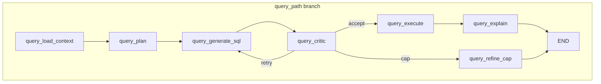

# Spec 06 — Query agent + critic / validator (read-only MCP execution)

**Sources of truth:** [TASK.md](../TASK.md), [AGENTS.md](../AGENTS.md). Build on [specs/01-bootstrap.md](01-bootstrap.md), [specs/02-tools-mcp.md](02-tools-mcp.md), [specs/03-graph-shell.md](03-graph-shell.md), [specs/04-schema-gate.md](04-schema-gate.md), and [specs/05-schema-agent-hitl.md](05-schema-agent-hitl.md). This spec **replaces** the query branch’s single **`query_stub`** node with a **query pipeline** plus a **critic loop**; it does not supersede prior specs.

**Forward compatibility:** Full **persistent vs session memory** (preferences, last SQL in thread store) belongs in the **next** memory spec. **LiteLLM / chat model factory** belongs in a later LLM spec. Until then, Spec 06 allows a **deterministic stub** NL→SQL path (same spirit as Spec 05’s stub draft when no model is configured). This spec **does** normatively define how the query path **loads** approved schema documentation from **`SCHEMA_DOCS_PATH`** per Spec 05 §8.

**Spec-only deliverable:** This file defines **requirements, layout, and contracts** for a future implementation. **Application code** (graph wiring, agents, tests) is **out of scope** for the act of “landing Spec 06”—implement it in a **separate** change set using §14–§15 as the checklist unless the team explicitly combines spec + code in one merge.

---

## 1. Purpose

Deliver the **Query Agent** slice of [TASK.md](../TASK.md): **natural language → plan → SQL → critic/validator → MCP `execute_readonly_sql` → structured answer** (SQL string, sample rows, explanation, limitations), with a **bounded refinement loop** when the critic rejects SQL—without violating [AGENTS.md](../AGENTS.md) (read-only execution path, no destructive SQL).

**Functional outcome:**

- **End-to-end query branch:** `query_load_context` → `query_plan` (planner) → `query_generate_sql` (executor) → `query_critic` → conditional **accept** → `query_execute` → `query_explain` → `END`; on **reject**, return to **`query_generate_sql`** until **`QUERY_MAX_REFINEMENTS`**, then `query_refine_cap` → `END` with a user-safe **`last_error`**.
- **Schema grounding:** When **`SCHEMA_DOCS_PATH`** exists and parses as JSON, load the schema docs JSON (per Spec 05 §8) into state as **`schema_docs_context`** for stub/LLM prompts. When the file is **missing** or invalid JSON, continue with **empty grounding** and record a **`schema_docs_warning`** (soft failure—still answer with stub SQL if possible).
- **Patterns:** **Planner / executor** decomposition (`query_plan` vs `query_generate_sql`) and **critic/validator** before MCP execution ([TASK.md](../TASK.md) §5). **Execution HITL** (human approval before every query) is **out of scope** here; rely on critic + MCP validation + read-only policy.
- **Proof:** Unit tests with **mocked MCP** prove happy path, critic retry, refinement cap, and missing-docs soft path; optional **`@pytest.mark.integration`** with Docker + MCP unchanged from prior specs.

---

## 2. Scope

| In scope | Out of scope (later / not this PR) |
| --- | --- |
| Replace **`query_stub`** wiring with **named nodes** + **`add_conditional_edges`** critic loop | Streamlit / HTTP API (separate UI spec) |
| **`agents/query_agent.py`**: plan + SQL generation **without** graph imports | Full **memory** store design (next spec) |
| **`graph/query_pipeline.py`**: async nodes, logging aligned with Spec 03 | **LiteLLM** wiring as its own deliverable |
| Load **`SCHEMA_DOCS_PATH`** payload (Spec 05 shape) into state | Rewriting Specs 01–05 |
| Critic: **`mcp_server.readonly_sql.validate_readonly_sql`** + **`LIMIT`** presence check | Duplicating full MCP server validation logic beyond that import |
| **`QUERY_MAX_REFINEMENTS`** env (default **3**) | General NL **intent router** on `user_input` ([specs/04-schema-gate.md](04-schema-gate.md) forbids gate misuse) |
| Unit tests + optional integration | Full observability rubric as own spec |

---

## 3. Target repository layout

Keep **graph orchestration** under **`src/graph/`** and **prompt-free NL logic** under **`src/agents/`** (same split as Spec 05).

```text
src/
  agents/
    __init__.py
    schema_agent.py          # existing
    query_agent.py             # NEW (implementation): build_query_plan, build_sql (stub or future LLM)
  graph/
    __init__.py
    state.py                   # extend GraphState (§7)
    graph.py                   # query_path → pipeline + conditional edges (replaces linear query_stub)
    nodes.py                   # shared helpers (e.g. get_mcp_client); query_stub retired from graph when implemented
    query_pipeline.py          # NEW (implementation): query_* nodes + route_after_critic
    schema_pipeline.py         # unchanged
    presence.py
    schema_paths.py            # reuse schema_docs_path_from_env()
```

**Packaging:** `agents` and `graph` are already wheel packages in [pyproject.toml](../pyproject.toml); no new top-level package is required if files live under existing packages.

**Async:** Nodes that call MCP remain **`async`** and use **`MultiServerMCPClient`** via existing **`get_mcp_client`** in [`graph/nodes.py`](../src/graph/nodes.py).

---

## 4. Dependencies

- **Python:** `>=3.12` ([pyproject.toml](../pyproject.toml)).
- **Runtime:** **`langgraph>=1.1.7`** (checkpointer already used for schema HITL—reuse for query path).
- **Existing:** `langchain-mcp-adapters`, MCP tools per [specs/02-tools-mcp.md](02-tools-mcp.md).
- **Critic:** Import **`validate_readonly_sql`** from **`mcp_server.readonly_sql`** so token rules stay **one source of truth** with the server.
- **New chat deps:** Only if implementing a real LLM in this PR—**prefer stub** and **`uv add`** in the LLM spec later ([AGENTS.md](../AGENTS.md): do not hand-edit dependency arrays).

---

## 5. Configuration

| Variable | Purpose | Notes |
| --- | --- | --- |
| `MCP_SERVER_URL` / MCP host+port | MCP client for **`execute_readonly_sql`**. | Same as Specs 02–03. |
| `SCHEMA_DOCS_PATH` | Approved schema docs JSON (Spec 05 §8). | Default `<repo>/data/schema_docs.json` via [`schema_docs_path_from_env()`](../src/graph/schema_paths.py). |
| `QUERY_MAX_REFINEMENTS` | Max **critic reject** cycles before **`query_refine_cap`**. | Default **3**. After increment, retry while `refinement_count < QUERY_MAX_REFINEMENTS` (§8.2). |
| `GRAPH_DEBUG` | Verbose snapshots. | Optional; same semantics as Spec 03. |

Document **`QUERY_MAX_REFINEMENTS`** in **`.env.example`** when implemented.

---

## 6. LangGraph API contract (normative)

### 6.1 Node sequence (query branch)

From **`query_path`** entry (first node after gate):

1. **`query_load_context`** — Read **`SCHEMA_DOCS_PATH`** if present; set **`schema_docs_context`** (e.g. parsed `dict` or `None`) and **`schema_docs_warning`** (`str | None`). Append **`query_load_context`** to **`steps`**; set **`gate_decision`: `"query_path"`** and **`schema_ready`: `True`** for parity with the old stub.
2. **`query_plan`** — Call **`agents.query_agent.build_query_plan`**. Store structured **`query_plan`** in state.
3. **`query_generate_sql`** — Call **`agents.query_agent.build_sql`** with `user_input`, `query_plan`, `schema_docs_context`, **`refinement_count`**. Store **`generated_sql`** (`str`). On retry, `query_plan` is **not** regenerated; only `generated_sql` and `refinement_count` are updated.
4. **`query_critic`** — Run **`validate_sql_for_execution`** (§6.3). Set **`critic_status`**: `"accept"` \| `"reject"`; **`critic_feedback`**: `str`. On **reject**, increment **`refinement_count`** (monotonic integer; starts at 0).
5. **`add_conditional_edges("query_critic", route_after_critic, {...})`** — See §6.2.
6. **`query_execute`** — Invoke MCP **`execute_readonly_sql`** with **`generated_sql`**. Store raw payload reference / normalized **`query_execution_result`**.
7. **`query_explain`** — Build **`query_explanation`** and set **`last_result`** to the **structured answer** (§6.4). Append **`query_explain`**; clear **`last_error`** on success path.
8. **`query_refine_cap`** — Set **`last_error`** to a stable message (e.g. "Critic rejected SQL after max refinement attempts"). Set **`last_result`** to `None`. Use this consistently in tests.

Edges:

- **`query_load_context` → `query_plan` → `query_generate_sql` → `query_critic`**
- **`query_critic` →** (conditional) → **`query_execute`** \| **`query_generate_sql`** \| **`query_refine_cap`**
- **`query_execute` → `query_explain` → `END`**
- **`query_refine_cap` → `END`**

### 6.2 Routing map (critic loop)

**Normative routing keys:** `"execute"`, `"retry"`, `"cap"`.

- If **`critic_status == "accept"`** → **`"execute"`**.
- If **`"reject"`** and **`refinement_count < QUERY_MAX_REFINEMENTS`** → **`"retry"`** (back to **`query_generate_sql`**).
- If **`"reject"`** and **`refinement_count >= QUERY_MAX_REFINEMENTS`** → **`"cap"`**.

**Refinement counting:** On each critic **reject**, increment **`refinement_count`** before routing so the **first** reject sets `1` and allows retry when **`QUERY_MAX_REFINEMENTS`** is `3` per the inequality above.

### 6.3 Critic implementation

1. Call **`validate_readonly_sql(generated_sql)`** from **`mcp_server.readonly_sql`**.
2. Additionally require a case-insensitive **`LIMIT`** clause in the original SQL (after strip) — align with [AGENTS.md](../AGENTS.md) “prefer `LIMIT` on exploratory queries.”
3. If either check fails → **`critic_status="reject"`** and **`critic_feedback`** with a short, user-safe reason (no secrets).

### 6.4 Structured `last_result` (success path)

Minimum keys (implementation may add fields if tests agree):

| Key | Purpose |
| --- | --- |
| `kind` | Literal discriminator, e.g. **`"query_answer"`**. |
| `sql` | Final executed SQL string. |
| `columns` / `rows` | From MCP payload when present. |
| `explanation` | Short NL summary of what was asked and what returned. |
| `limitations` | e.g. row cap, **`schema_docs_warning`** text if any. |

### 6.5 Checkpointer

Reuse **`get_compiled_graph(..., checkpointer=MemorySaver())`** ([specs/05-schema-agent-hitl.md](05-schema-agent-hitl.md)). Query path does **not** require **`interrupt()`** for this spec.

---

## 7. State schema (deltas on Spec 05)

Extend **`GraphState`** ([`graph/state.py`](../src/graph/state.py)) with **`total=False`** fields:

| Field | Purpose | Type |
| --- | --- | --- |
| `schema_docs_context` | Parsed docs JSON or `None`. | `dict \| None` |
| `schema_docs_warning` | Soft failure message when docs missing/invalid. | `str \| None` |
| `query_plan` | Planner output. | `dict \| None` |
| `generated_sql` | SQL string passed to critic and MCP. | `str \| None` |
| `critic_status` | `"accept"` \| `"reject"`. | `str \| None` |
| `critic_feedback` | Validator message. | `str \| None` |
| `refinement_count` | Number of critic rejects so far in this run. Initialized to `0`. | `int` |
| `query_execution_result` | MCP tool dict (or normalized subset). | `dict \| None` |
| `query_explanation` | NL explanation string. | `str \| None` |

Append **`steps`** entries: **`query_load_context`**, **`query_plan`**, **`query_generate_sql`**, **`query_critic`**, and on success **`query_execute`**, **`query_explain`**; append **`query_refine_cap`** on cap path.

**Minimal `TypedDict` excerpt (illustrative only — normative field list is the table above):**

```python
# Illustrative only — implement the full GraphState in graph/state.py.
class GraphState(TypedDict, total=False):
    user_input: str
    steps: list[str]
    schema_ready: bool | None
    gate_decision: str | None
    last_result: dict | None
    last_error: str | None
    # Spec 05 (unchanged)
    schema_metadata: dict | None
    schema_draft: dict | None
    schema_approved: dict | None
    hitl_prompt: dict | None
    persist_error: str | None
    # Spec 06
    schema_docs_context: dict | None
    schema_docs_warning: str | None
    query_plan: dict | None
    generated_sql: str | None
    critic_status: str | None
    critic_feedback: str | None
    refinement_count: int
    query_execution_result: dict | None
    query_explanation: str | None
```

---

## 8. Normative code snippets (illustrative only)

### 8.1 Conditional edges after critic

```python
# Illustrative only — wire real node callables in graph/graph.py.
from typing import Literal

from langgraph.graph import END, START, StateGraph

def route_after_critic(state: GraphState) -> Literal["execute", "retry", "cap"]:
    if state.get("critic_status") == "accept":
        return "execute"
    max_r = int(__import__("os").environ.get("QUERY_MAX_REFINEMENTS", "3"))
    if int(state.get("refinement_count") or 0) < max_r:
        return "retry"
    return "cap"

# builder.add_conditional_edges(
#     "query_critic",
#     route_after_critic,
#     {"execute": "query_execute", "retry": "query_generate_sql", "cap": "query_refine_cap"},
# )
```

### 8.2 Example success `last_result` JSON

```json
{
  "kind": "query_answer",
  "sql": "SELECT COUNT(*)::bigint AS n FROM public.actor LIMIT 10",
  "columns": ["n"],
  "rows": [{"n": 200}],
  "explanation": "Counted rows in public.actor as a smoke check.",
  "limitations": "Read-only SELECT with LIMIT; results may be truncated by MCP row cap."
}
```

---

## 9. MCP wiring

- **`query_execute`** only: **`execute_readonly_sql`** via **`MultiServerMCPClient`** — same discovery pattern as [specs/03-graph-shell.md](03-graph-shell.md) §8.
- **No** `inspect_schema` requirement on the query path unless a future self-heal spec adds it.

---

## 10. Nodes and edges (query branch)



**Integration with Spec 04:** The conditional edge from **`START`** is unchanged: **`SchemaPresence`** only decides **`schema_path`** vs **`query_path`**. **`user_input`** must **not** influence the gate.

---

## 11. Logging

- **Per node:** `graph_node_transition` style with **`graph_node`**, **`graph_phase`** (`enter` / `exit`), **`user_input_preview`**, **`steps_count`**.
- **Critic:** Log **`critic_status`** and **truncated** SQL preview (reuse server **`truncate_sql_preview`** if available).
- **Retries:** Log **`refinement_count`** on reject.

---

## 12. Acceptance criteria

1. **Graph compiles** with existing checkpointer default.
2. **Query path** runs **`query_load_context` → … → `query_explain`** on mocked MCP and stub agent; **`last_result["kind"] == "query_answer"`** on success.
3. **Critic retry:** First SQL fails critic → second SQL passes → **`refinement_count`** reflects one reject; **`steps`** contains **`query_generate_sql`** twice (once per attempt).
4. **Cap:** Forced repeated rejects exceed **`QUERY_MAX_REFINEMENTS`** → **`query_refine_cap`** runs, **`last_error`** set, no MCP execute on final cap transition.
5. **Missing `SCHEMA_DOCS_PATH`:** Run completes with **`schema_docs_warning`** set and no crash (stub still produces valid SQL).
6. **`uv run ruff check .`** and **`uv run ruff format .`** pass; **`uv run pytest tests/ -q`** passes.
7. **Conventional Commits** ([AGENTS.md](../AGENTS.md)).

---

## 13. Verification commands

```bash
docker compose up -d
uv sync
cp -n .env.example .env

uv run pytest tests/ -q
uv run pytest -m integration -q

uv run ruff check .
uv run ruff format .
```

---

## 14. Implementation checklist (follow-up coding task)

Use this list when implementing Spec 06 in the codebase—**not** as part of authoring or merging the spec document alone.

1. Add **`agents/query_agent.py`** with **`build_query_plan`** and **`build_sql`** (stub).
2. Add **`graph/query_pipeline.py`** with nodes + **`route_after_critic`** + **`validate_sql_for_execution`**.
3. Extend **`GraphState`** in **`graph/state.py`**.
4. Refactor **`graph/graph.py`**: **`query_path`** targets **`query_load_context`**; wire conditional edges; remove **`query_stub`** from the workflow (delete **`query_stub`** from **`nodes.py`** if unused).
5. Update **`tests/test_graph_shell.py`** expectations for **`steps`** / logging.
6. Add **`tests/test_query_pipeline.py`** for critic loop + cap + missing docs.
7. Update **`.env.example`** with **`QUERY_MAX_REFINEMENTS`**.
8. **Ruff + pytest**; commit with Conventional Commits.

---

## 15. Prompt for coding agent (optional)

Implement **`specs/06-query-agent-critic.md`**:

1. Stub **`query_agent`** + **`query_pipeline`** per §3; extend **`GraphState`**.
2. Replace **`query_stub`** in **`build_graph`** with the pipeline and **`add_conditional_edges`** from **`query_critic`**.
3. Critic uses **`validate_readonly_sql`** + **`LIMIT`** check; bounded retries per §6.2.
4. **`query_execute`** uses **`get_mcp_client`** from **`graph.nodes`**; **`last_result`** shape per §6.4.
5. **pytest** updates + new tests; **ruff** clean.

---

## 16. Key differences from Spec 05

| Aspect | Spec 05 | Spec 06 |
| --- | --- | --- |
| Branch | **`schema_path`** | **`query_path`** |
| HITL | **`interrupt()`** + persist | **None** (critic only) |
| Primary output | Persisted docs + marker | **`last_result` query answer** |
| Loop | Linear | **Critic conditional loop** |

---

## 17. Relationship to assignment themes

[TASK.md](../TASK.md) requires a **Query Agent** with **critic/validator** before execution, **safe read-only** queries, and **iterative refinement**. Spec 06 is the vertical slice for **query + critic + MCP execute + explanation**, grounded on **Spec 05** docs when present. **Memory** and **LiteLLM** specs extend this path later without renaming these nodes.
