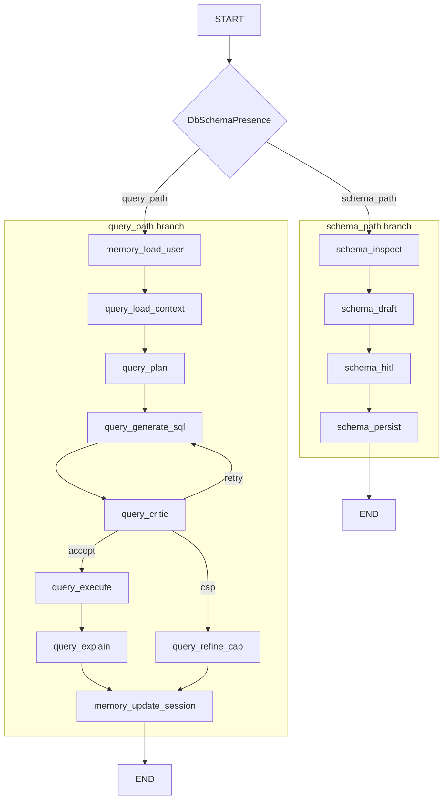

# Spec 07 — Memory (persistent preferences + schema docs + short-term session)

**Sources of truth:** [TASK.md](../TASK.md), [AGENTS.md](../AGENTS.md). Build on [specs/01-bootstrap.md](01-bootstrap.md), [specs/02-tools-mcp.md](02-tools-mcp.md), [specs/03-graph-shell.md](03-graph-shell.md), [specs/04-schema-gate.md](04-schema-gate.md), [specs/05-schema-agent-hitl.md](05-schema-agent-hitl.md), and [specs/06-query-agent-critic.md](06-query-agent-critic.md). This spec **replaces the file-based persistence contracts** of Specs 04 §8 and 05 §8 with a PostgreSQL-backed memory store. Nothing is deployed yet, so this is a clean swap with no backward-compatibility shim.

**Spec-only deliverable:** This file defines **requirements, layout, and contracts** for a future implementation. **Application code** is **out of scope** for the act of "landing Spec 07"—implement it in a separate change set using §17 as the checklist.

---

## 1. Purpose

Deliver the **Memory** slice of [TASK.md](../TASK.md):

1. **Persistent memory (across process restarts, across threads):** user preferences and approved schema documentation stored in **PostgreSQL** via raw **`psycopg`**, on a dedicated `app_memory` database in a **separate container** from the `dvdrental` container.
2. **Short-term memory (within a session/thread):** conversation continuity via the `MemorySaver` checkpointer (already wired in Spec 05) keyed by `thread_id`, plus explicit `GraphState` fields that carry last SQL, last user input, assumptions, and recent filters between turns.

**Functional outcomes:**

- **Two new persistent tables** in `app_memory`: `user_preferences` and `schema_docs`.
- **`schema_persist`** (Spec 05) writes approved descriptions to `schema_docs` instead of two JSON files.
- **`query_load_context`** (Spec 06) reads schema docs from `SchemaDocsStore` instead of the filesystem.
- **`DbSchemaPresence`** replaces `FileSchemaPresence` as the sole gate implementation; it queries `schema_docs.ready`.
- **Two new graph nodes** on the query path: `memory_load_user` (loads prefs + schema docs into state) and `memory_update_session` (persists session fields after each run).
- **Proof:** Prefs survive a process restart; schema docs round-trip through the DB; thread continuity is visible in state; memory DB being down never crashes the query path.

---

## 2. Scope

| In scope                                                                                       | Out of scope (later / not this PR)                     |
| ---------------------------------------------------------------------------------------------- | ------------------------------------------------------ |
| `src/memory/` package (`db.py`, `preferences.py`, `schema_docs.py`, `session.py`)              | Vector/semantic memory (ChromaDB)                      |
| `AppMemorySettings` (`pydantic-settings`)                                                      | Working-memory truncation (`tiktoken`)                 |
| Second Postgres service in `docker-compose.yml`                                                | LangGraph `PostgresStore` / `BaseStore` migration      |
| `DbSchemaPresence` — sole presence implementation                                              | Streamlit preferences UI (spec 10)                     |
| Delete `FileSchemaPresence`, `schema_paths.py`, file-write helpers in `schema_pipeline.py`     | Per-provider SDK LLM deps (spec 08)                    |
| State fields: `user_id`, `preferences`, `preferences_dirty`, session fields, `memory_warning`  | Multi-user auth or login flow                          |
| `memory_load_user` + `memory_update_session` nodes on query path                               | `inspect_schema` on every query (Spec 02 is unchanged) |
| `.env.example` updated (add `APP_MEMORY_*`; remove `SCHEMA_DOCS_PATH`, `SCHEMA_PRESENCE_PATH`) | —                                                      |

---

## 3. Target repository layout

```text
src/
  memory/
    __init__.py
    db.py                  # psycopg connection factory for app_memory
    preferences.py         # UserPreferencesStore: ensure_table + get + upsert
    schema_docs.py         # SchemaDocsStore: ensure_table + get_payload + is_ready + upsert_approved
    session.py             # helpers: seed session state; snapshot last SQL/input
  graph/
    state.py               # extend GraphState (§8)
    graph.py               # wire memory_load_user / memory_update_session on query_path
    memory_nodes.py        # NEW: memory_load_user, memory_update_session
    presence.py            # REPLACE: delete FileSchemaPresence; add DbSchemaPresence
    query_pipeline.py      # REFACTOR: query_load_context reads from SchemaDocsStore
    schema_pipeline.py     # REFACTOR: schema_persist writes via SchemaDocsStore
    schema_paths.py        # DELETE (outright)
  config/
    __init__.py            # export AppMemorySettings
    memory_settings.py     # NEW: AppMemorySettings (pydantic-settings)
    mcp_settings.py        # unchanged
    postgres_settings.py   # unchanged
```

**Packaging:** add `src/memory` to `[tool.hatch.build.targets.wheel] packages` in `pyproject.toml` and extend `known-first-party` in `[tool.ruff.lint.isort]` with `memory`. Both are `pyproject.toml` edits — do them by hand in the implementation PR (the "no `uv add`" rule applies to the `dependencies` table, not to the hatchling packages list or ruff config).

---

## 4. Dependencies

- **Python:** `>=3.12` ([pyproject.toml](../pyproject.toml)).
- **Runtime:** `psycopg[binary]` (already declared), `pydantic-settings` (already declared), `langgraph>=1.1.7` (already declared).
- **No new packages in this slice.** Do NOT add `tiktoken`, `chromadb`, `langgraph[postgres]`, or per-provider LLM SDKs ([AGENTS.md](../AGENTS.md): use `uv add` only when adding a real new dependency).

---

## 5. Configuration

### 5.1 New: `AppMemorySettings`

Add `src/config/memory_settings.py`:

```python
# Illustrative only — implement in config/memory_settings.py.
from pydantic_settings import BaseSettings, SettingsConfigDict


class AppMemorySettings(BaseSettings):
    model_config = SettingsConfigDict(
        env_file=".env",
        env_file_encoding="utf-8",
        extra="ignore",
        case_sensitive=False,
    )

    app_memory_host: str = "localhost"
    app_memory_port: int = 5433
    app_memory_user: str = "postgres"
    app_memory_password: str = "mysecretpassword"
    app_memory_db: str = "app_memory"
    default_user_id: str = "default"
    default_thread_id: str = "default-thread"
```

### 5.2 Environment variable table

| Variable              | Default            | Purpose                                                                    |
| --------------------- | ------------------ | -------------------------------------------------------------------------- |
| `APP_MEMORY_HOST`     | `localhost`        | Host for the memory DB (mapped from container port 5432 → host port 5433). |
| `APP_MEMORY_PORT`     | `5433`             | Host port of the second Postgres container.                                |
| `APP_MEMORY_USER`     | `postgres`         | —                                                                          |
| `APP_MEMORY_PASSWORD` | `mysecretpassword` | —                                                                          |
| `APP_MEMORY_DB`       | `app_memory`       | Database name inside the memory container.                                 |
| `DEFAULT_USER_ID`     | `default`          | Identity key when no user is explicitly supplied.                          |
| `DEFAULT_THREAD_ID`   | `default-thread`   | Matches `graph_run_config`'s default `thread_id`.                          |

**Deleted from `.env.example`:** `SCHEMA_DOCS_PATH`, `SCHEMA_PRESENCE_PATH` (and their comments). Both env vars are gone.

---

## 6. Docker Compose integration

Add a second service and volume to `docker-compose.yml`. The `mcp-server` service is **not** modified — MCP remains dedicated to the `dvdrental` container. The host application reads memory via `APP_MEMORY_*` env vars.

```yaml
# Add to the services: block in docker-compose.yml.
postgres-app-memory:
  image: postgres:18
  container_name: multiagent-app-memory-postgres
  environment:
    POSTGRES_DB: app_memory
    POSTGRES_USER: postgres
    POSTGRES_PASSWORD: mysecretpassword
  ports:
    - "5433:5432"
  volumes:
    - app_memory_data:/var/lib/postgresql
  healthcheck:
    test: ["CMD-SHELL", "pg_isready -U postgres -d app_memory"]
    interval: 10s
    timeout: 5s
    retries: 5
    start_period: 10s

# Add to the volumes: block.
# volumes:
#   postgres_data:       (existing)
#   app_memory_data:     (new)
```

**Rule:** `mcp-server` must not gain any environment variable pointing to `app_memory` — memory access is the application host's concern, not the MCP server's.

---

## 7. Persistence contract (canonical location; replaces Specs 04 §8 and 05 §8)

### 7.1 Two tables in `app_memory`

#### `user_preferences`

```sql
-- DDL for user_preferences — illustrative; implement in memory/preferences.py ensure_table()
CREATE TABLE IF NOT EXISTS user_preferences (
    user_id     TEXT        PRIMARY KEY,
    prefs       JSONB       NOT NULL DEFAULT '{}'::jsonb,
    created_at  TIMESTAMPTZ NOT NULL DEFAULT now(),
    updated_at  TIMESTAMPTZ NOT NULL DEFAULT now()
);
```

#### `schema_docs`

```sql
-- DDL for schema_docs — illustrative; implement in memory/schema_docs.py ensure_table()
-- Single-row table enforced by CHECK (id = 1); no separate marker file needed.
CREATE TABLE IF NOT EXISTS schema_docs (
    id          SMALLINT    PRIMARY KEY DEFAULT 1 CHECK (id = 1),
    version     INT         NOT NULL,
    payload     JSONB       NOT NULL,
    ready       BOOLEAN     NOT NULL DEFAULT false,
    updated_at  TIMESTAMPTZ NOT NULL DEFAULT now()
);
```

### 7.2 Preferences JSON shape (normative minimum)

```json
{
  "preferred_language": "en",
  "output_format": "table",
  "date_format": "ISO8601",
  "safety_strictness": "strict",
  "row_limit_hint": 10
}
```

Implementers may add more keys; the five above are the canonical minimum the spec guarantees.

### 7.3 Schema docs payload shape

Same shape defined in [specs/05-schema-agent-hitl.md](05-schema-agent-hitl.md) §8.2 — stored verbatim in the `payload` JSONB column:

```json
{
  "version": 1,
  "updated_at": "2026-04-17T12:00:00Z",
  "source": "schema_agent_hitl",
  "tables": [
    {
      "schema": "public",
      "name": "actor",
      "description": "Approved table description.",
      "columns": [
        { "name": "actor_id", "description": "Approved column description." }
      ]
    }
  ]
}
```

Optional `metadata_fingerprint` (from Spec 05 §8.2) may also be stored as a top-level key.

**Row `version` vs payload `version`:** The SQL `schema_docs.version` column must match the payload’s top-level `"version"` integer. On `upsert_approved`, set the column from `payload.get("version", 1)` so the stored row stays aligned with the JSON document.

### 7.4 Read and write contracts

**`UserPreferencesStore`:**

- `get(user_id) -> dict`: `SELECT prefs FROM user_preferences WHERE user_id = %s`. Returns defaults dict (five canonical keys with defaults) if no row exists. Does **not** insert on read.
- `upsert(user_id, prefs)`: `INSERT INTO user_preferences … ON CONFLICT (user_id) DO UPDATE SET prefs = EXCLUDED.prefs, updated_at = now()`. Only called when `preferences_dirty` is `True` in state.

**`SchemaDocsStore`:**

- `get_payload() -> dict | None`: `SELECT payload FROM schema_docs WHERE id = 1`. Returns `None` if no row. If app_memory is unreachable, **`psycopg.OperationalError` propagates** (so `memory_load_user` / tests can distinguish “no row” from “cannot connect”).
- `is_ready() -> bool`: `SELECT ready FROM schema_docs WHERE id = 1`. Returns `False` if no row or if `ready` is false. If app_memory is unreachable, **`OperationalError` propagates** — **`DbSchemaPresence.check()`** (and any graph node that needs soft-fail) **must catch** it and map to `SchemaPresenceResult(ready=False, reason=…)` / warnings (§7.5).
- `upsert_approved(payload, metadata_fingerprint=None)`: atomic single statement `INSERT INTO schema_docs (id, version, payload, ready, updated_at) VALUES (1, …) ON CONFLICT (id) DO UPDATE SET version=…, payload=…, ready=true, updated_at=now()`. Replaces the two-file atomic write ordering of Spec 05 §8.3.

### 7.5 Soft failure

If the memory DB is unreachable (`psycopg.OperationalError`):

- `DbSchemaPresence.check()` returns `SchemaPresenceResult(ready=False, reason="app_memory unreachable")`.
- `memory_load_user` uses **separate** try blocks for preferences vs schema docs so a failure in one does not wipe the other. On prefs failure: set `memory_warning`, **`preferences` = `default_preferences()`** (not `None`). On schema-docs failure: set `schema_docs_warning` (and `memory_warning` if not already set from prefs). Proceed; the query path continues.
- `memory_update_session` logs the failure and skips the upsert; no crash.
- **Never** propagate a DB connection error as an unhandled exception from a graph node.

---

## 8. State schema (deltas on Spec 06)

Extend **`GraphState`** ([`graph/state.py`](../src/graph/state.py)) with **`total=False`** fields:

| Field                 | Purpose                                                            | Type                |
| --------------------- | ------------------------------------------------------------------ | ------------------- |
| `user_id`             | Stable identity key for persistent prefs.                          | `str`               |
| `session_id`          | Optional friendly label; defaults to `thread_id`.                  | `str \| None`       |
| `preferences`         | Loaded prefs snapshot (from `UserPreferencesStore.get`).           | `dict \| None`      |
| `preferences_dirty`   | `True` when pipeline set a preference that needs persisting.       | `bool`              |
| `previous_user_input` | NL question from the previous turn on this thread.                 | `str \| None`       |
| `previous_sql`        | Last successfully executed SQL on this thread.                     | `str \| None`       |
| `assumptions`         | Planner/critic assumptions surfaced to the user.                   | `list[str] \| None` |
| `recent_filters`      | Inferred date ranges, table scopes, etc. for follow-up continuity. | `dict \| None`      |
| `memory_warning`      | Soft-failure message if memory DB unreachable.                     | `str \| None`       |

`schema_docs_context` and `schema_docs_warning` (from Spec 06) are **preserved** — their semantics are unchanged; only the source of the data moves from filesystem to DB.

**`session_id` seeding:** `graph_run_config` (§11.8) puts `session_id` in `state_seed`, defaulting to the same string as `thread_id` (the LangGraph `configurable["thread_id"]`) unless the caller passes an explicit `session_id`. Treat it as an optional display or logging label; **prefs identity remains `user_id` only**.

**Minimal `TypedDict` excerpt (illustrative only — normative field list is the table above):**

```python
# Illustrative only — implement the full GraphState in graph/state.py.
class GraphState(TypedDict, total=False):
    # ... existing fields from Specs 03–06 ...

    # Spec 07 additions
    user_id: str
    session_id: str | None
    preferences: dict | None
    preferences_dirty: bool
    previous_user_input: str | None
    previous_sql: str | None
    assumptions: list[str] | None
    recent_filters: dict | None
    memory_warning: str | None
```

---

## 9. `src/memory/` package contracts

### 9.1 `memory/db.py` — connection factory

```python
# Illustrative only — implement in memory/db.py.
import psycopg
from psycopg.rows import dict_row

from config.memory_settings import AppMemorySettings


def get_app_memory_connection(settings: AppMemorySettings | None = None):
    """Return a psycopg connection to the app_memory database."""
    s = settings or AppMemorySettings()
    dsn = (
        f"host={s.app_memory_host} port={s.app_memory_port} "
        f"dbname={s.app_memory_db} user={s.app_memory_user} "
        f"password={s.app_memory_password}"
    )
    return psycopg.connect(dsn, row_factory=dict_row)
```

### 9.2 `memory/preferences.py` — `UserPreferencesStore`

```python
# Illustrative only — implement in memory/preferences.py.
from __future__ import annotations

import logging
from datetime import UTC, datetime
from typing import Any

import psycopg

from memory.db import get_app_memory_connection

logger = logging.getLogger(__name__)

_DEFAULTS: dict[str, Any] = {
    "preferred_language": "en",
    "output_format": "table",
    "date_format": "ISO8601",
    "safety_strictness": "strict",
    "row_limit_hint": 10,
}


def default_preferences() -> dict[str, Any]:
    """Canonical defaults (same base dict as merge in UserPreferencesStore.get)."""
    return dict(_DEFAULTS)


class UserPreferencesStore:
    """PostgreSQL-backed user preferences. Mirrors the course memory demo style."""

    def __init__(self, settings=None) -> None:
        self._settings = settings
        self._ensure_table()

    def _ensure_table(self) -> None:
        with get_app_memory_connection(self._settings) as conn:
            with conn.cursor() as cur:
                cur.execute(
                    """
                    CREATE TABLE IF NOT EXISTS user_preferences (
                        user_id     TEXT        PRIMARY KEY,
                        prefs       JSONB       NOT NULL DEFAULT '{}'::jsonb,
                        created_at  TIMESTAMPTZ NOT NULL DEFAULT now(),
                        updated_at  TIMESTAMPTZ NOT NULL DEFAULT now()
                    )
                    """
                )
            conn.commit()

    def get(self, user_id: str) -> dict[str, Any]:
        """Return stored prefs or schema defaults. Does not insert."""
        with get_app_memory_connection(self._settings) as conn:
            with conn.cursor() as cur:
                cur.execute(
                    "SELECT prefs FROM user_preferences WHERE user_id = %s",
                    (user_id,),
                )
                row = cur.fetchone()
        if row is None:
            return dict(_DEFAULTS)
        stored = row["prefs"] if isinstance(row, dict) else {}
        return {**_DEFAULTS, **stored}

    def upsert(self, user_id: str, prefs: dict[str, Any]) -> None:
        """Insert or update prefs for user_id."""
        with get_app_memory_connection(self._settings) as conn:
            with conn.cursor() as cur:
                cur.execute(
                    """
                    INSERT INTO user_preferences (user_id, prefs, updated_at)
                    VALUES (%s, %s::jsonb, %s)
                    ON CONFLICT (user_id) DO UPDATE
                        SET prefs      = EXCLUDED.prefs,
                            updated_at = EXCLUDED.updated_at
                    """,
                    (user_id, psycopg.types.json.Jsonb(prefs), datetime.now(UTC)),
                )
            conn.commit()
        logger.info(
            "preferences_upserted",
            extra={"user_id": user_id, "prefs_keys": sorted(prefs.keys())},
        )
```

### 9.3 `memory/schema_docs.py` — `SchemaDocsStore`

```python
# Illustrative only — implement in memory/schema_docs.py.
from __future__ import annotations

import hashlib
import json
import logging
from datetime import UTC, datetime
from typing import Any

import psycopg

from memory.db import get_app_memory_connection

logger = logging.getLogger(__name__)


class SchemaDocsStore:
    """Single-row PostgreSQL store for approved schema documentation."""

    def __init__(self, settings=None) -> None:
        self._settings = settings
        self._ensure_table()

    def _ensure_table(self) -> None:
        with get_app_memory_connection(self._settings) as conn:
            with conn.cursor() as cur:
                cur.execute(
                    """
                    CREATE TABLE IF NOT EXISTS schema_docs (
                        id          SMALLINT    PRIMARY KEY DEFAULT 1 CHECK (id = 1),
                        version     INT         NOT NULL,
                        payload     JSONB       NOT NULL,
                        ready       BOOLEAN     NOT NULL DEFAULT false,
                        updated_at  TIMESTAMPTZ NOT NULL DEFAULT now()
                    )
                    """
                )
            conn.commit()

    def get_payload(self) -> dict[str, Any] | None:
        """Return stored payload dict or None if no row (raises if DB unreachable)."""
        with get_app_memory_connection(self._settings) as conn:
            with conn.cursor() as cur:
                cur.execute("SELECT payload FROM schema_docs WHERE id = 1")
                row = cur.fetchone()
        if row is None:
            return None
        return row["payload"] if isinstance(row, dict) else None

    def is_ready(self) -> bool:
        """True iff a row exists and ready=true (raises if DB unreachable)."""
        with get_app_memory_connection(self._settings) as conn:
            with conn.cursor() as cur:
                cur.execute("SELECT ready FROM schema_docs WHERE id = 1")
                row = cur.fetchone()
        if row is None:
            return False
        return bool(row["ready"] if isinstance(row, dict) else False)

    def upsert_approved(
        self,
        payload: dict[str, Any],
        metadata_fingerprint: str | None = None,
    ) -> None:
        """Atomically store approved schema docs and flip ready=true."""
        if metadata_fingerprint:
            payload = {**payload, "metadata_fingerprint": metadata_fingerprint}
        with get_app_memory_connection(self._settings) as conn:
            with conn.cursor() as cur:
                cur.execute(
                    """
                    INSERT INTO schema_docs (id, version, payload, ready, updated_at)
                    VALUES (1, %s, %s::jsonb, true, %s)
                    ON CONFLICT (id) DO UPDATE
                        SET version    = EXCLUDED.version,
                            payload    = EXCLUDED.payload,
                            ready      = true,
                            updated_at = EXCLUDED.updated_at
                    """,
                    (
                        payload.get("version", 1),
                        psycopg.types.json.Jsonb(payload),
                        datetime.now(UTC),
                    ),
                )
            conn.commit()
        logger.info(
            "schema_docs_persisted",
            extra={
                "table_count": len(payload.get("tables") or []),
                "has_fingerprint": metadata_fingerprint is not None,
            },
        )
```

### 9.4 `memory/session.py` — session helpers

```python
# Illustrative only — implement in memory/session.py.
from __future__ import annotations

from typing import Any


def seed_session_fields(state: dict[str, Any]) -> dict[str, Any]:
    """Return state deltas to initialise short-term session fields."""
    return {
        "previous_user_input": state.get("previous_user_input"),
        "previous_sql": state.get("previous_sql"),
        "assumptions": state.get("assumptions"),
        "recent_filters": state.get("recent_filters"),
    }


def snapshot_session_fields(state: dict[str, Any]) -> dict[str, Any]:
    """Extract session fields from completed run to carry into next turn."""
    last = state.get("last_result") or {}
    return {
        "previous_user_input": state.get("user_input"),
        "previous_sql": last.get("sql") if isinstance(last, dict) else None,
        "assumptions": state.get("assumptions"),
        "recent_filters": state.get("recent_filters"),
    }
```

---

## 10. `DbSchemaPresence` — replaces `FileSchemaPresence`

```python
# Illustrative only — replace FileSchemaPresence in graph/presence.py with this.
# SchemaPresenceResult and SchemaPresence live in this same module (above this class).
import logging

import psycopg

from memory.schema_docs import SchemaDocsStore

logger = logging.getLogger(__name__)


class DbSchemaPresence:
    """SchemaPresence implementation backed by app_memory.schema_docs."""

    def __init__(self, store: SchemaDocsStore | None = None) -> None:
        self._store = store

    @classmethod
    def from_settings(cls, settings=None) -> "DbSchemaPresence":
        return cls(store=SchemaDocsStore(settings=settings))

    def check(self) -> SchemaPresenceResult:
        try:
            store = self._store or SchemaDocsStore()
            ready = store.is_ready()
        except psycopg.OperationalError as exc:
            reason = f"app_memory unreachable: {type(exc).__name__}"
            logger.warning(
                "schema_presence_db_error",
                extra={"reason": reason},
            )
            return SchemaPresenceResult(ready=False, reason=reason)
        reason = None if ready else "schema_docs.ready is false or row missing"
        logger.info(
            "schema_presence_check",
            extra={"schema_docs_ready": ready, "reason": reason},
        )
        return SchemaPresenceResult(ready=ready, reason=reason)
```

---

## 11. LangGraph API contract (normative)

### 11.1 Query-path node sequence

```text
memory_load_user
  → query_load_context
  → query_plan
  → query_generate_sql
  → query_critic
  → (conditional via route_after_critic)
       accept → query_execute → query_explain → memory_update_session → END
       retry  → query_generate_sql  (loop)
       cap    → query_refine_cap → memory_update_session → END
```

`memory_update_session` sits at the **end of every terminal path** on the query branch so session fields are always snapshotted regardless of success or cap.

### 11.2 Schema-path node sequence (unchanged shape)

```text
schema_inspect → schema_draft → schema_hitl → schema_persist → END
```

Only `schema_persist`'s internals change (§11.6). The gate (`route_after_start`) now calls `DbSchemaPresence`.

### 11.3 `memory_load_user` node

```python
# Illustrative only — implement in graph/memory_nodes.py.
from __future__ import annotations

import logging
from typing import Any

import psycopg

from config.memory_settings import AppMemorySettings
from graph.state import GraphState
from memory.preferences import UserPreferencesStore, default_preferences
from memory.schema_docs import SchemaDocsStore
from memory.session import seed_session_fields

logger = logging.getLogger(__name__)


async def memory_load_user(state: GraphState) -> dict[str, Any]:
    steps = list(state.get("steps", []))
    steps.append("memory_load_user")
    settings = AppMemorySettings()
    user_id = state.get("user_id") or settings.default_user_id

    logger.info(
        "graph_node_transition",
        extra={
            "graph_node": "memory_load_user",
            "graph_phase": "enter",
            "user_id": user_id,
            "steps_count": len(steps),
        },
    )

    out: dict[str, Any] = {
        "steps": steps,
        "user_id": user_id,
        "memory_warning": None,
        "schema_docs_warning": None,
        "schema_docs_context": None,
        "preferences": None,
    }
    out.update(seed_session_fields(state))

    try:
        pref_store = UserPreferencesStore(settings)
        out["preferences"] = pref_store.get(user_id)
    except psycopg.OperationalError as exc:
        warn = f"app_memory unreachable: {type(exc).__name__}"
        out["memory_warning"] = warn
        out["preferences"] = default_preferences()
        logger.warning(
            "memory_load_user_db_error",
            extra={"graph_node": "memory_load_user", "phase": "preferences", "warning": warn},
        )

    try:
        docs_store = SchemaDocsStore(settings)
        payload = docs_store.get_payload()
        if payload is not None:
            out["schema_docs_context"] = payload
        else:
            out["schema_docs_warning"] = "No approved schema docs in app_memory"
    except psycopg.OperationalError as exc:
        warn = f"app_memory unreachable: {type(exc).__name__}"
        out["schema_docs_warning"] = warn
        if out.get("memory_warning") is None:
            out["memory_warning"] = warn
        logger.warning(
            "memory_load_user_db_error",
            extra={"graph_node": "memory_load_user", "phase": "schema_docs", "warning": warn},
        )

    logger.info(
        "graph_node_transition",
        extra={
            "graph_node": "memory_load_user",
            "graph_phase": "exit",
            "user_id": user_id,
            "has_prefs": out["preferences"] is not None,
            "has_schema_docs": out["schema_docs_context"] is not None,
            "memory_warning": out["memory_warning"],
            "steps_count": len(steps),
        },
    )
    return out
```

### 11.4 `memory_update_session` node

```python
# Illustrative only — implement in graph/memory_nodes.py.
from __future__ import annotations

import logging
from typing import Any

import psycopg

from config.memory_settings import AppMemorySettings
from graph.state import GraphState
from memory.preferences import UserPreferencesStore
from memory.session import snapshot_session_fields

logger = logging.getLogger(__name__)


async def memory_update_session(state: GraphState) -> dict[str, Any]:
    steps = list(state.get("steps", []))
    steps.append("memory_update_session")
    settings = AppMemorySettings()
    user_id = state.get("user_id") or settings.default_user_id

    logger.info(
        "graph_node_transition",
        extra={
            "graph_node": "memory_update_session",
            "graph_phase": "enter",
            "user_id": user_id,
            "steps_count": len(steps),
        },
    )

    session_delta = snapshot_session_fields(state)
    out: dict[str, Any] = {"steps": steps, **session_delta}

    if state.get("preferences_dirty"):
        prefs = state.get("preferences") or {}
        try:
            store = UserPreferencesStore(settings)
            store.upsert(user_id, prefs)
        except psycopg.OperationalError as exc:
            warn = f"could not persist preferences: {type(exc).__name__}"
            out["memory_warning"] = warn
            logger.warning(
                "memory_update_session_db_error",
                extra={"graph_node": "memory_update_session", "warning": warn},
            )

    logger.info(
        "graph_node_transition",
        extra={
            "graph_node": "memory_update_session",
            "graph_phase": "exit",
            "user_id": user_id,
            "preferences_dirty": bool(state.get("preferences_dirty")),
            "steps_count": len(steps),
        },
    )
    return out
```

### 11.5 `query_load_context` refactor (key delta vs Spec 06)

The node's schema-loading block changes from filesystem to DB. Before (Spec 06):

```python
# Before (Spec 06 — reading from disk):
path = schema_docs_path_from_env()
raw_text = Path(path).read_text(encoding="utf-8")
schema_docs_context = json.loads(raw_text)
```

After (Spec 07 — reading from DB):

```python
# After (Spec 07 — reading from SchemaDocsStore):
# schema_docs_context is now loaded by memory_load_user before this node runs.
# query_load_context reads it directly from state — no file I/O.
schema_docs_context = state.get("schema_docs_context")
schema_docs_warning = state.get("schema_docs_warning")
```

`query_load_context` no longer touches the filesystem, `SCHEMA_DOCS_PATH`, or `schema_docs_path_from_env`. Its job is reduced to resetting refinement counters and gate-decision stamp.

### 11.6 `schema_persist` refactor (key delta vs Spec 05)

Before (Spec 05 — two atomic file writes):

```python
# Before:
write_json_atomic(docs_path, payload_doc)
write_json_atomic(marker_path, marker_doc)
```

After (Spec 07 — single DB upsert):

```python
# After (Spec 07 — SchemaDocsStore.upsert_approved):
from memory.schema_docs import SchemaDocsStore
from config.memory_settings import AppMemorySettings

store = SchemaDocsStore(AppMemorySettings())
try:
    store.upsert_approved(payload_doc, metadata_fingerprint=fingerprint)
    out["schema_ready"] = True
    out["last_result"] = {
        "kind": "schema_persist",
        "success": True,
        "table_count": len(tables),
    }
except psycopg.OperationalError as exc:
    msg = f"could not persist schema docs: {type(exc).__name__}"
    out["persist_error"] = msg
    out["last_error"] = msg
```

The `write_json_atomic`, `FileSchemaPresence`, and `schema_docs_path_from_env` imports are removed from `schema_pipeline.py`.

### 11.7 Gate update

`build_graph` in `graph/graph.py` uses `DbSchemaPresence` as the default:

```python
# Illustrative only — update build_graph in graph/graph.py.
from graph.presence import DbSchemaPresence, SchemaPresence

def build_graph(*, presence: SchemaPresence | None = None) -> StateGraph:
    resolved: SchemaPresence = presence or DbSchemaPresence.from_settings()
    # ... rest unchanged ...
```

### 11.8 Thread and user identity contract

```python
# Illustrative only — updated graph_run_config in graph/graph.py.
from langchain_core.runnables import RunnableConfig
from config.memory_settings import AppMemorySettings


def graph_run_config(
    *,
    thread_id: str | None = None,
    user_id: str | None = None,
    session_id: str | None = None,
) -> tuple[RunnableConfig, dict]:
    """Return (config, initial_state_overrides) for invoke/ainvoke.

    thread_id goes into configurable (required by MemorySaver).
    user_id goes into initial state so routing never reads from configurable.
    session_id defaults to thread_id for an optional display/logging label.
    """
    s = AppMemorySettings()
    tid = thread_id or s.default_thread_id
    uid = user_id or s.default_user_id
    sid = session_id if session_id is not None else tid
    config: RunnableConfig = {"configurable": {"thread_id": tid}}
    state_seed = {"user_id": uid, "session_id": sid}
    return config, state_seed
```

**Rule:** routing functions (`route_after_start`, `route_after_critic`) must **never** read from `config["configurable"]` for user identity — only from `state["user_id"]` (consistent with Spec 04 §6 routing-purity rule).

### 11.9 Idempotency

- `memory_load_user` only **reads** app_memory (plus append-only `steps`) — safe to re-run after checkpointer replay for DB-backed fields.
- `memory_update_session` guards the `upsert` behind `state.get("preferences_dirty")` — replaying the node without the flag set is a no-op.

---

## 12. How preferences influence the pipeline (documentation only)

No behaviour change is shipped in this spec. The fields are loaded and visible in state; nodes in later specs consume them:

| Preference key       | Future consumer                                                  |
| -------------------- | ---------------------------------------------------------------- |
| `row_limit_hint`     | `build_sql` (spec 08+) uses as suggested LIMIT in generated SQL. |
| `output_format`      | `query_explain` result rendering (spec 10 Streamlit).            |
| `safety_strictness`  | `query_critic` (optional stricter rejection policy).             |
| `preferred_language` | LLM system prompt (spec 08).                                     |
| `date_format`        | LLM system prompt / result formatting (spec 08+).                |

---

## 13. Nodes and edges (full graph — amended)



---

## 14. Logging

- **`memory_load_user`:** enter/exit with `user_id`, `has_prefs`, `has_schema_docs`, `memory_warning`.
- **`memory_update_session`:** enter/exit with `user_id`, `preferences_dirty`, `memory_warning`.
- **`DbSchemaPresence.check()`:** `schema_presence_check` with `schema_docs_ready` + `reason`.
- **`SchemaDocsStore.upsert_approved()`:** `schema_docs_persisted` with `table_count`, `has_fingerprint`.
- **`UserPreferencesStore.upsert()`:** `preferences_upserted` with `user_id`, `prefs_keys` (key list only — never log pref values).
- **Never** log raw preference values, raw schema payload, or connection strings.

---

## 15. Replaces Specs 04 §8 and 05 §8

Nothing is deployed yet. The swap is clean deletion with no backward-compatibility shim.

| Removed                                                   | Reason                                                               |
| --------------------------------------------------------- | -------------------------------------------------------------------- |
| `SCHEMA_DOCS_PATH` env var + `.env.example` entry         | Superseded by `app_memory.schema_docs.payload`                       |
| `SCHEMA_PRESENCE_PATH` env var + `.env.example` entry     | Superseded by `app_memory.schema_docs.ready`                         |
| `data/schema_docs.json`                                   | No longer written by `schema_persist`                                |
| `data/schema_presence.json`                               | No longer written by `schema_persist`                                |
| `graph/schema_paths.py` (entire file)                     | `schema_docs_path_from_env()` no longer needed                       |
| `FileSchemaPresence` class                                | Replaced by `DbSchemaPresence`                                       |
| `write_json_atomic()` in `schema_pipeline.py`             | Replaced by `SchemaDocsStore.upsert_approved()`                      |
| `import schema_docs_path_from_env` in `query_pipeline.py` | `query_load_context` reads from state (loaded by `memory_load_user`) |

Prior spec **documents** (`specs/04-schema-gate.md`, `specs/05-schema-agent-hitl.md`) remain in the repository as the historical record per project conventions. Their §8 file-based persistence text no longer describes the running code.

---

## 16. Acceptance criteria

1. **Two Postgres containers:** `docker compose up -d` starts `multiagent-postgres` (port 5432) and `multiagent-app-memory-postgres` (port 5433); `docker ps` shows both healthy.
2. **Preferences survive restart:** unit test — `UserPreferencesStore.upsert("alice", {...})`, drop the instance, construct a fresh `UserPreferencesStore`, call `get("alice")` → values match.
3. **Schema docs round-trip:** `SchemaDocsStore.upsert_approved(payload)` → `DbSchemaPresence.check().ready == True` → `SchemaDocsStore.get_payload()` returns the same payload. A `memory_load_user` node run with that store populated returns the payload as `schema_docs_context`.
4. **Thread continuity:** same `thread_id`, two `ainvoke` calls (MemorySaver) — second call's state has `previous_user_input` and `previous_sql` from the first.
5. **Cross-thread prefs:** two different `thread_id`s for the same `user_id` → both loads return same prefs; session fields (`previous_sql`, etc.) are fresh for the second thread.
6. **Memory DB down (soft fail):** with `postgres-app-memory` stopped, `ainvoke` on the query path completes — `last_result` is produced (or `last_error` from critic/execute); `memory_warning` and `schema_docs_warning` are set; no unhandled exception raised.
7. **Gate after schema persist:** after `schema_persist` runs via `SchemaDocsStore.upsert_approved`, a subsequent `ainvoke` routes to `query_path` (`DbSchemaPresence.check().ready == True`).
8. `uv run ruff check .` and `uv run ruff format .` pass; `uv run pytest tests/ -q` passes.
9. Conventional Commits ([AGENTS.md](../AGENTS.md)).

---

## 17. Verification commands

```bash
# Start both containers.
docker compose up -d

# Verify both Postgres containers are healthy.
docker ps --filter name=multiagent-postgres
docker ps --filter name=multiagent-app-memory-postgres

# Inspect the memory DB schema after first run (tables created on demand).
docker exec multiagent-app-memory-postgres \
  psql -U postgres -d app_memory -c "\dt"

# Sync Python deps.
uv sync
cp -n .env.example .env

# Run tests.
uv run pytest tests/ -q
uv run pytest -m integration -q

# Lint.
uv run ruff check .
uv run ruff format .
```

---

## 18. Implementation checklist (follow-up coding task)

Use this list when implementing Spec 07 in the codebase — **not** as part of authoring or merging the spec document alone.

1. **`docker-compose.yml`:** add `postgres-app-memory` service and `app_memory_data` volume per §6.
2. **`src/config/memory_settings.py`:** `AppMemorySettings` per §5.1; export from `config/__init__.py`.
3. **`src/memory/__init__.py`:** empty or minimal package init.
4. **`src/memory/db.py`:** `get_app_memory_connection` per §9.1.
5. **`src/memory/preferences.py`:** `UserPreferencesStore` + `default_preferences()` per §9.2.
6. **`src/memory/schema_docs.py`:** `SchemaDocsStore` per §9.3.
7. **`src/memory/session.py`:** `seed_session_fields`, `snapshot_session_fields` per §9.4.
8. **`src/graph/presence.py`:** delete `FileSchemaPresence`; add `DbSchemaPresence` per §10. Keep `SchemaPresence` protocol and `SchemaPresenceResult` NamedTuple.
9. **`src/graph/memory_nodes.py`:** `memory_load_user` and `memory_update_session` per §11.3–11.4.
10. **`src/graph/graph.py`:** update `build_graph` to use `DbSchemaPresence`; wire `memory_load_user` before `query_load_context` and `memory_update_session` at both query-path terminals (`query_explain → memory_update_session → END`, `query_refine_cap → memory_update_session → END`); update `graph_run_config` per §11.8 (`session_id` defaults to `thread_id`).
11. **`src/graph/query_pipeline.py`:** refactor `query_load_context` per §11.5 — remove file-based schema loading; read `schema_docs_context` / `schema_docs_warning` from state (already set by `memory_load_user`).
12. **`src/graph/schema_pipeline.py`:** refactor `schema_persist` per §11.6 — replace `write_json_atomic` calls with `SchemaDocsStore.upsert_approved`; remove `FileSchemaPresence` import; remove `schema_docs_path_from_env` import.
13. **Delete `src/graph/schema_paths.py`** (entire file).
14. **`src/graph/state.py`:** add Spec 07 state fields per §8.
15. **`pyproject.toml`:** add `src/memory` to `packages`; add `memory` to `known-first-party` in ruff isort.
16. **`.env.example`:** add `APP_MEMORY_*` and `DEFAULT_USER_ID`/`DEFAULT_THREAD_ID` vars; remove `SCHEMA_DOCS_PATH` and `SCHEMA_PRESENCE_PATH` lines.
17. **Tests:** update any test that used `FileSchemaPresence` or created `data/schema_docs.json` / `data/schema_presence.json` — inject `DbSchemaPresence` with a mock `SchemaDocsStore`; add unit tests for `UserPreferencesStore` round-trip, `SchemaDocsStore` round-trip, and `memory_load_user` soft-fail path.
18. **Ruff + pytest + Conventional Commits.**

---

## 19. Prompt for coding agent (optional)

Implement **`specs/07-memory.md`**:

1. Add `postgres-app-memory` service to `docker-compose.yml` (§6).
2. Add `AppMemorySettings` in `config/memory_settings.py` (§5.1).
3. Create `src/memory/` package: `db.py`, `preferences.py`, `schema_docs.py`, `session.py` (§9).
4. Replace `FileSchemaPresence` with `DbSchemaPresence` in `graph/presence.py` (§10).
5. Add `graph/memory_nodes.py` with `memory_load_user` and `memory_update_session` (§11.3–11.4).
6. Update `build_graph` in `graph/graph.py` — gate uses `DbSchemaPresence`; wire memory nodes on both query-path terminals (§11.7, §11.1).
7. Refactor `query_load_context` (§11.5) and `schema_persist` (§11.6).
8. Delete `graph/schema_paths.py`; add Spec 07 state fields to `graph/state.py`.
9. Update `pyproject.toml`, `.env.example`, and tests.
10. **pytest** passing; **ruff** clean.

---

## 20. Key differences from Spec 06

| Aspect               | Spec 06                                         | Spec 07                                                |
| -------------------- | ----------------------------------------------- | ------------------------------------------------------ |
| Schema docs source   | `data/schema_docs.json` (filesystem)            | `app_memory.schema_docs` (PostgreSQL)                  |
| Gate implementation  | `FileSchemaPresence` (JSON marker file)         | `DbSchemaPresence` (SQL `SELECT ready`)                |
| User preferences     | Not present                                     | `app_memory.user_preferences` (PostgreSQL)             |
| Session continuity   | Implicit in checkpointer only                   | Explicit `GraphState` fields + `memory_update_session` |
| Query-path terminals | `query_explain → END`, `query_refine_cap → END` | Both → `memory_update_session → END`                   |
| Memory DB container  | None                                            | `postgres-app-memory` (port 5433)                      |

---

## 21. Relationship to assignment themes

[TASK.md](../TASK.md) §3 requires:

- **Persistent Memory:** stores user preferences across sessions — satisfied by `UserPreferencesStore` + `app_memory.user_preferences`.
- **Short-term Memory:** maintains session context (previous question, last SQL, assumptions, filters) — satisfied by `MemorySaver` checkpointer (thread-scoped) + `GraphState` session fields updated by `memory_update_session`.

**Minimum Acceptance Checklist** items directly addressed by this spec:

- "Persistent memory stores user preferences across sessions." ✓
- "Short-term memory supports conversational continuity." ✓

[AGENTS.md](../AGENTS.md) read-only SQL rule: the `app_memory` container is the **app's** store — DDL (`CREATE TABLE IF NOT EXISTS`) runs on the `app_memory` DB, never on `dvdrental`. MCP tools only ever read `dvdrental`; the memory DB is accessed directly by `psycopg` from the application host.
